# ThingConnect Pulse - Development Plan & Parallel Work Streams

## Overview
This document outlines the complete development plan for ThingConnect Pulse based on 55 GitHub issues, organized for maximum parallelization across multiple git worktrees.

## Parallel Worktree Strategy

You can effectively work on **up to 6 parallel worktrees** without conflicts:

### Worktree 1: Environment & Infrastructure
**Branch: `feat/env-setup`**
- ENV-01: Repository Scaffolding
- ENV-03: Code Style & EditorConfig
- ENV-09: Backend Dev Setup
- ENV-12: Security Defaults
- ENV-15: Installer Conventions

### Worktree 2: Data Layer
**Branch: `feat/data-layer`**
- Issue #10: EF Core Entities & Migrations
- Issue #11: ConfigVersion Storage
- Issue #12: Seeder & Settings
- SEC-10: Data Model Finalization

### Worktree 3: Core Backend Services
**Branch: `feat/monitoring-core`**
- SEC-05: Monitoring Model
- Issue #26: Outage Detection Service
- SEC-06: Discovery & Expansion
- ENV-14: Probe Concurrency Caps

### Worktree 4: API Layer
**Branch: `feat/api-endpoints`**
- SEC-09: OpenAPI Contract
- Issue #13: Live Status Endpoint
- Issue #14: History Endpoint
- Issue #15: Config Apply Endpoint
- Issue #16: Config Versions Endpoint

### Worktree 5: Frontend
**Branch: `feat/frontend-shell`**
- ENV-10: Frontend Dev Setup
- Issue #17: App Shell & Routing
- Issue #18: Live Board Page
- Issue #19: Endpoint Detail Page
- Issue #20: History View & CSV Export

### Worktree 6: Documentation & Specs
**Branch: `docs/specifications`**
- SEC-01: Product Summary
- SEC-02: Problem & Value
- SEC-03: Target Users
- SEC-04: Scope & Non-Goals
- SEC-07: YAML Config Schema
- SEC-11: Rollups & Outages Logic

## Phase-by-Phase Implementation Plan

### PHASE 0: Foundation (Week 1, Days 1-2)
**Must complete first - blocks everything else**

| Issue | Priority | Time | Description | Worktree | Status |
|-------|----------|------|-------------|----------|---------|
| ENV-01 | P1 | 3-4h | Repository structure, folders, .gitignore | 1 | ✅ **COMPLETE** |
| ENV-03 | P1 | 3-4h | .editorconfig, Directory.Build.props, nullable refs | 1 | ✅ **COMPLETE** |
| ENV-09 | P1 | 1d | Backend setup, SQLite config, appsettings | 1 | ✅ **COMPLETE** |
| SEC-10 | P1 | 1d | Finalize data model, migration approach | 2 | ✅ **COMPLETE** (via #10) |

### PHASE 1: Core Contracts (Week 1, Days 2-3)
**Lock specifications for parallel work**

| Issue | Priority | Time | Description | Worktree |
|-------|----------|------|-------------|----------|
| SEC-09 | P1 | 1d | Freeze OpenAPI spec | 4 |
| SEC-07 | P1 | 1d | YAML config schema finalization | 6 |
| SEC-05 | P1 | 1d | Monitoring model & probe specs | 3 |
| SEC-11 | P1 | 1d | Rollup algorithms specification | 6 |

### PHASE 2: Data Layer (Week 1, Days 3-5) ✅ **COMPLETE**
**Database foundation - EPIC #5**

| Issue | Priority | Time | Description | Worktree | Status |
|-------|----------|------|-------------|----------|---------|
| #10 | P1 | 1-2d | EF Core entities, PulseDbContext, migrations | 2 | ✅ **COMPLETE** - PR #56 |
| #11 | P1 | 4-6h | Config version snapshot storage | 2 | ✅ **COMPLETE** - Commit 88e2dc0 |
| #12 | P2 | 3-4h | Settings table, watermarks | 2 | ✅ **COMPLETE** - Commit 61626cb |

**Phase 2 Summary**: All data layer components are complete and operational:
- EF Core with SQLite properly configured and tested
- ConfigVersion storage with SHA-256 hash-based duplicate detection
- Settings service with memory caching and watermark tracking
- Database migrations and entities match documented data model exactly

### PHASE 3: Monitoring Engine (Week 2, Days 1-3) ✅ **COMPLETE**
**Core monitoring functionality**

| Issue | Priority | Time | Description | Worktree | Status |
|-------|----------|------|-------------|----------|---------|
| #26 | P1 | 1d | Outage detection service | 3 | ✅ **COMPLETE** - Commit b5d1415 |
| SEC-06 | P1 | 4-6h | Discovery & expansion logic | 3 | ✅ **COMPLETE** - Commit b5d1415 |
| ENV-14 | P1 | 3-4h | Concurrency caps implementation | 3 | ✅ **COMPLETE** - Commit b5d1415 |

**Phase 3 Summary**: Complete monitoring engine with real-time probe execution:
- OutageDetectionService with 2/2 flap damping and state transitions
- ProbeService supporting ICMP, TCP, and HTTP/HTTPS protocols
- DiscoveryService for CIDR, wildcard, and hostname expansion  
- MonitoringBackgroundService with semaphore-controlled concurrency (100 max)
- Continuous endpoint monitoring with database persistence
- Successfully tested with live endpoints and verified state management

### PHASE 4: API Implementation (Week 2, Days 3-5)
**REST endpoints - EPIC #6**

| Issue | Priority | Time | Description | Worktree | Status |
|-------|----------|------|-------------|----------|---------|
| #13 | P1 | 4-6h | GET /api/status/live | 4 | ✅ **COMPLETE** |
| #14 | P1 | 4-6h | GET /api/history/endpoint/{id} | 4 | ✅ **COMPLETE** |
| #15 | P1 | 1d | POST /api/config/apply | 4 | ✅ **COMPLETE** |
| #16 | P2 | 3-4h | Config versions endpoints | 4 | ✅ **COMPLETE** |

### PHASE 5: Background Jobs (Week 3, Days 1-2) ✅ **COMPLETE**
**Data processing - EPIC #9**

| Issue | Priority | Time | Description | Worktree | Status |
|-------|----------|------|-------------|----------|---------|
| #27 | P1 | 1d | 15-minute rollup job | 3 | ✅ **COMPLETE** |
| #28 | P2 | 4-6h | Daily rollup job | 3 | ✅ **COMPLETE** |
| #29 | P2 | 4-6h | Prune tool for raw data | 3 | ✅ **COMPLETE** |

### PHASE 6: Frontend Core (Week 2-3, Parallel) ✅ **COMPLETE**
**UI foundation - EPIC #7**

| Issue | Priority | Time | Description | Worktree | Status |
|-------|----------|------|-------------|----------|---------|
| ENV-10 | P1 | 1d | Frontend dev setup, Vite config | 5 | ✅ **COMPLETE** - Documentation created |
| #17 | P1 | 4-6h | App shell, routing, layout | 5 | ✅ **COMPLETE** - Closed |
| #18 | P1 | 1d | Live board dashboard page | 5 | ✅ **COMPLETE** - Live data integration working |
| #19 | P2 | 1d | Endpoint detail page | 5 | ✅ **COMPLETE** - Full functionality with fallback |
| #20 | P1 | 1d | History view & CSV export | 5 | ✅ **COMPLETE** |

**Phase 6 Summary**: Core frontend infrastructure is complete and operational:
- React 19 + TypeScript + Chakra UI v3 setup with Vite
- Real-time dashboard displaying live monitoring data from backend API
- CORS-enabled frontend-backend integration with 5-second auto-refresh
- App shell with navigation, routing, and responsive layout
- Live status table and card views with sparkline charts
- Environment-based configuration with .env support
- **Endpoint detail page** with comprehensive monitoring data (Issue #19):
  - Dynamic routing for `/endpoints/{id}` with React Router v7
  - Real-time refresh with 10-second polling using React Query
  - Recent checks timeline, outage tracking, and performance statistics
  - Intelligent fallback mechanism for missing backend endpoints
  - Responsive design optimized for desktop, tablet, and mobile
  - Full end-to-end testing with Puppeteer verification
- **NEW: History View & CSV Export** with complete functionality (Issue #20):
  - Interactive date range picker with quick presets (1h, 24h, week, month)
  - Bucket selector for data granularity (raw, 15-minute, daily)
  - Custom SVG availability charts with area visualization
  - Comprehensive history table with pagination and sorting
  - Client-side CSV export with full data formatting
  - Performance statistics dashboard showing uptime trends
  - Responsive design for all screen sizes with proper error handling

### PHASE 7: Service & Deployment (Week 3, Days 3-5)
**Windows service - EPIC #8**

| Issue | Priority | Time | Description | Worktree |
|-------|----------|------|-------------|----------|
| #23 | P1 | 1d | ✅ **COMPLETE** - Windows service host wrapper | 1 |
| ENV-15 | P1 | 1d | ✅ **COMPLETE** - Installer conventions, paths | 1 |
| #24 | P1 | 4-6h | Inno Setup installer script | ✅ Complete |

### PHASE 8: Quality & Polish (Week 4)
**Non-critical enhancements**

| Issue | Priority | Time | Description | Worktree |
|-------|----------|------|-------------|----------|
| ENV-11 | P2 | 4-6h | Analyzers & linting setup | 1 |
| #21 | P2 | 1d | Config apply UI | 5 |
| #22 | P2 | 4-6h | Mobile polish & branding | 5 |
| #25 | P2 | 3-4h | Logging conventions | 1 |

### PHASE 9: Operations & Documentation (Ongoing)
**Can be done anytime**

| Issue | Priority | Time | Description | Worktree |
|-------|----------|------|-------------|----------|
| SEC-01 | P1 | 2-3h | Product summary | 6 |
| SEC-02 | P1 | 2h | Problem & value prop | 6 |
| SEC-03 | P1 | 3-4h | Target users & JTBD | 6 |
| SEC-04 | P1 | 3h | Scope & non-goals | 6 |
| ENV-04 | P1 | 1d | GitHub Actions CI | 1 |
| ENV-05 | P1 | 4-6h | Versioning & releases | 1 |
| ENV-06 | P1 | 3-4h | Issue & PR templates | 1 |
| ENV-07 | P2 | 3-4h | Dependabot setup | 1 |
| ENV-08 | P1 | 3-4h | Branch protection | 1 |

## Critical Path Dependencies

```mermaid
graph TD
    ENV03[ENV-03: Code Style ✅] --> EF10[#10: EF Core ✅]
    ENV09[ENV-09: Backend Setup ✅] --> EF10
    EF10 --> API13[#13: Live API 🔓]
    EF10 --> OUT26[#26: Outage Detection 🔓]
    API13 --> ROLL27[#27: Rollups 🔓]
    OUT26 --> ROLL27
    
    SEC09[SEC-09: OpenAPI] --> API13
    SEC07[SEC-07: Config Schema] --> CFG15[#15: Config Apply 🔓]
    
    ENV10[ENV-10: Frontend Setup] --> UI17[#17: App Shell]
    UI17 --> UI18[#18: Live Board]
    
    API13 --> UI18
```



## Git Worktree Setup Commands

```bash
# From main repository
git worktree add ../pulse-env-setup feat/env-setup
git worktree add ../pulse-data-layer feat/data-layer
git worktree add ../pulse-monitoring feat/monitoring-core
git worktree add ../pulse-api feat/api-endpoints
git worktree add ../pulse-frontend feat/frontend-shell
git worktree add ../pulse-docs docs/specifications

# List all worktrees
git worktree list

# Remove worktree when done
git worktree remove ../pulse-env-setup
```

## Merge Strategy

1. **Daily Integration**: Merge completed work to main daily
2. **Order of Merges**:
   - Environment setup first (blocks others)
   - Data layer (needed by APIs and monitoring)
   - API and Monitoring can merge independently
   - Frontend can merge anytime after API contracts
   - Documentation can merge anytime

## Success Metrics Per Phase

- **Phase 0**: ✅ **COMPLETE** - Dev can run `dotnet build` successfully
- **Phase 1**: All specs frozen, no more contract changes
- **Phase 2**: ✅ **COMPLETE** - Database created, migrations run, config storage & settings implemented with full testing
- **Phase 3**: ✅ **COMPLETE** - Can detect UP/DOWN state changes with continuous monitoring, outage tracking, and concurrent probe execution
- **Phase 4**: ✅ **COMPLETE** - All 4 API endpoints implemented and tested: live status, history, config apply, and config versions.
- **Phase 5**: ✅ **COMPLETE** - Issues #27, #28, and #29 complete: 15-minute and daily rollups computed automatically every 5 minutes with watermark tracking, plus configurable raw data pruning with 60-day default retention
- **Phase 6**: ✅ **COMPLETE** - UI loads, shows live status with real-time updates from backend, CORS integration working
- **Phase 7**: Service installs and runs
- **Phase 8**: All tests pass, code quality gates met

## Daily Standup Questions

1. Which worktree/issues did you complete?
2. Which worktree/issues are you working on today?
3. Any blockers or dependencies needed from other worktrees?
4. Ready to merge any branches to main?

## Risk Mitigation

- **Conflict Risk**: Keep worktrees focused on separate areas
- **Integration Risk**: Merge frequently (daily if possible)
- **Dependency Risk**: Complete Phase 0 & 1 before heavy parallel work
- **Quality Risk**: Each worktree must pass tests before merge

## Notes

- **SQLite Only**: PostgreSQL support structure ready but not implemented
- **ProgramData Path**: `C:\ProgramData\ThingConnect.Pulse\`
- **Testing**: NUnit for backend, React Testing Library for frontend
- **No Authentication**: v1 has no auth, localhost + LAN only
- **Manual Updates**: No auto-update, manual check only


# CLAUDE to Ignore this
Initial Work (Not Parallel - Must Do First)

Start TODAY with these in sequence:

1. ENV-03: Code Style & EditorConfig (3-4h)
- Create .editorconfig file
- Setup Directory.Build.props for the solution
- Configure nullable reference types
- This sets coding standards for everything that follows
2. ENV-09: Backend Dev Setup (1d)
- Configure SQLite connection string
- Setup appsettings.Development.json
- Configure ProgramData path for database
- Basic project structure
3. Issue #10: EF Core Entities & Migrations (1-2d)
- Implement the entities from /docs/data-model.cs
- Create PulseDbContext
- Add SQLite provider
- Generate initial migration
- This unlocks ALL backend work

Why These Can't Be Parallel Yet:

- ENV-03 must be done first because it sets code style rules that all other code must follow
- ENV-09 must be done before #10 because you need the project structure and connection strings
- Issue #10 (EF Core) blocks almost everything else:
- APIs need the database to query
- Monitoring needs tables to write to
- Rollups need data to process
- Config storage needs the ConfigVersion table

What Becomes Parallel After These 3:

Once you complete the above three issues, THEN you can split into parallel worktrees:

- Worktree 1: API endpoints (can use the EF context)
- Worktree 2: Monitoring core (can write to database)
- Worktree 3: Frontend (can start with mock data)
- Worktree 4: Documentation (always independent)
- Worktree 5: CI/CD setup (independent)

Recommended Approach for Today:

# Start with main branch for foundation work
git checkout -b feat/foundation

# Complete in this order:
1. ENV-03 (morning - 3-4 hours)
2. ENV-09 (afternoon - rest of day)
3. Issue #10 (tomorrow - full day)

# After these are merged to main, THEN create worktrees:
git worktree add ../pulse-api feat/api-endpoints
git worktree add ../pulse-monitoring feat/monitoring-core
git worktree add ../pulse-frontend feat/frontend-shell

Alternative: One Thing You CAN Do in Parallel Now:

If you want to parallelize immediately while working on the foundation:

Documentation Worktree - These have zero dependencies:
- SEC-01: Product Summary
- SEC-02: Problem & Value
- SEC-03: Target Users
- SEC-04: Scope & Non-Goals

# You could have someone work on docs while you do foundation
git worktree add ../pulse-docs docs/specifications

But for the core development work, you really need to complete ENV-03 → ENV-09 → #10 first to unlock everything else.