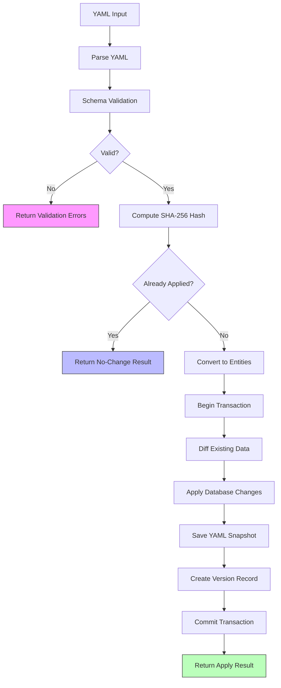

# ThingConnect Pulse - Configuration Apply Flow

This document defines the complete configuration apply lifecycle, validation rules, diff logic, and idempotency guarantees for ThingConnect Pulse v1.

## Apply Lifecycle Overview

The configuration apply process follows a strict **validate → diff → snapshot → reload** workflow:



## API Endpoint Specification

### POST /api/config/apply

**Purpose**: Validate and apply YAML configuration with atomic transaction guarantees.

**Request Format**:
```http
POST /api/config/apply HTTP/1.1
Content-Type: text/plain
X-Actor: admin@company.com           # Optional: who is applying
X-Note: "Updated prod web servers"   # Optional: change description

version: 1
defaults:
  interval_seconds: 10
  # ... full YAML content
```

**Success Response** (200 OK):
```json
{
  "config_version_id": "20240825143052-a7b8c9d0",
  "added": 5,
  "updated": 3,
  "removed": 1, 
  "warnings": [
    "Group 'legacy' has no targets and may be unused"
  ]
}
```

**Validation Error Response** (400 Bad Request):
```json
{
  "message": "Configuration validation failed",
  "errors": [
    {
      "path": "targets[0].interval_seconds",
      "message": "Value must be at least 1 second",
      "value": 0
    },
    {
      "path": "groups[1].id", 
      "message": "Group ID must match pattern ^[a-z0-9][a-z0-9-]{1,62}[a-z0-9]$",
      "value": "Invalid-Group-ID!"
    }
  ]
}
```

**Server Error Response** (500 Internal Server Error):
```json
{
  "message": "Internal server error while applying configuration",
  "errors": [
    {
      "path": "",
      "message": "Database transaction failed: connection timeout",
      "value": null
    }
  ]
}
```

## Validation Rules

### Schema Validation

**JSON Schema**: `/docs/config.schema.json` enforces structural validation:

**Version Requirements**:
- `version`: Must be exactly `1` (integer)
- Required at root level

**Defaults Validation**:
- `interval_seconds`: Integer ≥ 1, default 10
- `timeout_ms`: Integer ≥ 100, default 1500  
- `retries`: Integer ≥ 0, default 1
- All defaults fields required

**Groups Validation**:
- Minimum 1 group required
- `id`: Pattern `^[a-z0-9][a-z0-9-]{1,62}[a-z0-9]$`
- `name`: String, 1-128 characters
- `parent_id`: Must reference existing group ID (prevents cycles)
- `color`: Optional hex color code
- `sort_order`: Optional integer for UI ordering

**Targets Validation**:
- Minimum 1 target required
- `name`: String, 1-128 characters, must be unique
- `group`: Must reference existing group ID
- `type`: Enum ["icmp", "tcp", "http", "https"]
- `host`: String, 1-255 characters (hostname, IP, or pattern)
- `port`: Integer 1-65535 (required for TCP/HTTP)
- `path`: String for HTTP (optional, default "/")
- `expect_text`: String for HTTP content validation (optional)
- `interval_seconds`: Integer ≥ 1 (inherits from defaults)
- `timeout_ms`: Integer ≥ 100 (inherits from defaults)

### Business Logic Validation

**Post-Schema Validation** (future enhancement):
- Group hierarchy cycle detection
- Hostname/IP address format validation
- Port range validation by probe type
- Reasonable interval/timeout combinations

### Current Implementation Notes

**v1 Limitations**:
- Schema validation temporarily disabled in `ConfigParser.cs` (lines 40-56)
- Basic YAML parsing validation only
- Structural validation via C# model binding

## Duplicate Detection & Idempotency

### Hash-Based Detection

**Algorithm**: SHA-256 hash computed on raw YAML content
```csharp
private static string ComputeHash(string content)
{
    byte[] bytes = Encoding.UTF8.GetBytes(content);
    byte[] hash = SHA256.HashData(bytes);
    return Convert.ToHexString(hash).ToLowerInvariant();
}
```

**Idempotency Guarantee**: Identical YAML content returns no-change result:
```json
{
  "config_version_id": "20240825120000-existing1", 
  "added": 0,
  "updated": 0,
  "removed": 0,
  "warnings": ["Configuration already applied - no changes made"]
}
```

**Hash Comparison**: Case-sensitive, whitespace-sensitive, comment-sensitive
- Different formatting = different hash = new application
- YAML normalization not performed in v1

## Diff Logic & Entity Matching

### Group Matching Strategy

**Primary Key**: `Group.Id` (exact string match)

**Diff Operations**:
- **Added**: Groups in new config not in database
- **Updated**: Existing groups with changed `Name`, `ParentId`, `Color`, or `SortOrder`
- **Removed**: Database groups not in new config

**Update Logic**:
```csharp
if (existingDict.TryGetValue(group.Id, out Group? existingGroup))
{
    existingGroup.Name = group.Name;           // Always updated
    existingGroup.ParentId = group.ParentId;   // Hierarchy changes
    existingGroup.Color = group.Color;         // UI appearance  
    existingGroup.SortOrder = group.SortOrder; // Display ordering
    updatedCount++;
}
```

### Endpoint Matching Strategy

**Composite Key**: `Name|Host|Port` (pipe-separated string)
- **Rationale**: Same logical service can have multiple probe types
- **Example**: `"Web Server|api.company.com|443"`

**Key Generation**:
```csharp
string key = $"{endpoint.Name}|{endpoint.Host}|{endpoint.Port}";
```

**Diff Operations**:
- **Added**: New Name+Host+Port combinations
- **Updated**: Changed properties for existing combinations
- **Removed**: Existing combinations not in new config

**Update Logic**:
```csharp
if (existingByKey.TryGetValue(key, out Endpoint? existingEndpoint))
{
    existingEndpoint.GroupId = endpoint.GroupId;           // Group assignment
    existingEndpoint.Type = endpoint.Type;                 // Probe type changes
    existingEndpoint.IntervalSeconds = endpoint.IntervalSeconds;
    existingEndpoint.TimeoutMs = endpoint.TimeoutMs;
    existingEndpoint.Retries = endpoint.Retries;          // Future use
    existingEndpoint.HttpPath = endpoint.HttpPath;         // HTTP-specific
    existingEndpoint.HttpMatch = endpoint.HttpMatch;       // Content validation
    updatedCount++;
}
```

**Preserved Fields**: Fields not managed by configuration remain unchanged:
- `Id` (GUID): Database primary key preserved
- `LastStatus`, `LastRttMs`, `LastChangeTs`: Monitoring state preserved
- `ExpectedRttMs`, `Notes`: User annotations preserved

## Configuration Versioning & Snapshots

### Version ID Generation

**Format**: `YYYYMMDDHHMMSS-{8-char-guid}`
**Example**: `20240825143052-a7b8c9d0`

```csharp
private static string GenerateVersionId()
{
    return DateTimeOffset.UtcNow.ToString("yyyyMMddHHmmss") + "-" +
           Guid.NewGuid().ToString("N")[..8];
}
```

### File Snapshot Storage

**Directory**: `%ProgramData%\ThingConnect.Pulse\versions\`
**Filename Format**: `YYYYMMDD_HHMMSS_{hash8}.yaml`
**Example**: `20240825_143052_a7b8c9d0.yaml`

**Storage Process**:
1. Generate timestamp and hash-based filename
2. Write raw YAML content to file (preserves formatting)
3. Store file path in database for retrieval

### Database Version Record

**Table**: `ConfigVersions`
```sql
CREATE TABLE ConfigVersions (
    Id TEXT PRIMARY KEY,                    -- Version ID
    AppliedTs DATETIME NOT NULL,            -- UTC timestamp
    FileHash TEXT NOT NULL,                 -- SHA-256 hash
    FilePath TEXT NOT NULL,                 -- Full file path
    Actor TEXT NULL,                        -- X-Actor header
    Note TEXT NULL                          -- X-Note header  
);
```

**Indexes**:
- Primary key on `Id`
- Unique index on `FileHash` (duplicate prevention)
- Index on `AppliedTs` (chronological ordering)

## Transaction Guarantees & Error Handling

### ACID Properties

**Atomicity**: All-or-nothing transaction semantics
```csharp
using IDbContextTransaction transaction = await _context.Database.BeginTransactionAsync();
try
{
    // Apply all database changes
    await ApplyChangesToDatabaseAsync(groups, endpoints);
    
    // Write snapshot file
    await File.WriteAllTextAsync(filePath, yamlContent);
    
    // Create version record
    _context.ConfigVersions.Add(configVersion);
    await _context.SaveChangesAsync();
    
    await transaction.CommitAsync();
}
catch
{
    await transaction.RollbackAsync();
    throw;
}
```

**Consistency**: Database constraints enforced:
- Foreign key relationships (Group → Endpoint)
- Unique constraints on version hashes
- Check constraints on value ranges

**Isolation**: Transaction isolation prevents concurrent modifications

**Durability**: Changes persisted to SQLite database file

### Error Recovery

**Database Rollback**: Failed transactions leave database unchanged
**File Cleanup**: Orphaned snapshot files cleaned up on restart (future enhancement)
**State Preservation**: Monitoring state preserved during config errors

### Concurrent Apply Protection

**Current Implementation**: No explicit locking (SQLite handles basic concurrency)
**Risk**: Concurrent applies could cause transaction conflicts
**Future Enhancement**: Advisory locking or config apply serialization

## Discovery & Expansion

### CIDR Range Expansion

**Input Format**: `"192.168.1.1-254"` or `"192.168.1.0/24"`
**Expansion Logic**: Generate individual IP endpoints
**Example**:
```yaml
targets:
  - name: "Office Network"
    type: "icmp" 
    host: "192.168.1.1-254"
```
Becomes 254 individual endpoints: `192.168.1.1`, `192.168.1.2`, ..., `192.168.1.254`

### Wildcard Hostname Expansion

**Input Format**: `"web*.company.com"`
**Expansion Logic**: DNS resolution of wildcard patterns
**Example**:
```yaml
targets:
  - name: "Web Servers"
    type: "http"
    host: "web*.company.com"
```
Resolves to individual hostnames: `web1.company.com`, `web2.company.com`, etc.

**Implementation Status**: Planned for DiscoveryService integration

## Configuration Reload & Monitoring Impact

### Live Monitoring Updates

**Service Integration**: `MonitoringBackgroundService` detects config changes
**Update Process**:
1. Configuration applied to database
2. Background service refreshes endpoint list (every 1 minute)
3. New/removed endpoints start/stop monitoring
4. Updated endpoints restart with new parameters

**State Preservation**: Existing monitoring state maintained across config changes:
- Ongoing outages continue tracking
- Historical data preserved
- State machine positions maintained

### Zero-Downtime Updates

**No Service Restart**: Configuration changes apply without server restart
**Monitoring Continuity**: Existing checks continue during config update
**New Endpoint Activation**: New endpoints begin monitoring within 1 minute

## Warnings & Validation Messages

### Warning Conditions

**Empty Groups**: Groups with no associated targets
```json
"warnings": ["Group 'legacy' has no targets and may be unused"]
```

**Large Intervals**: Intervals > 300 seconds for critical systems
```json
"warnings": ["Target 'Production API' has 600s interval - consider more frequent monitoring"]
```

**External Dependencies**: Non-RFC1918 addresses flagged
```json  
"warnings": ["Target 'api.example.com' is external - consider network dependency implications"]
```

**Future Enhancements**: Additional warnings for:
- Aggressive timeout/interval combinations
- Missing HTTP paths for web services
- Unreachable group hierarchy references

## Configuration Validation Test Cases

### Valid Configuration Tests

**Minimal Valid Config**:
```yaml
version: 1
defaults:
  interval_seconds: 10
  timeout_ms: 1500
  retries: 1
groups:
  - id: "default"
    name: "Default Group"
targets:
  - name: "Test"
    group: "default" 
    type: "icmp"
    host: "127.0.0.1"
```

**Complex Valid Config**: See `/docs/sample.config.yaml`

### Invalid Configuration Tests

**Missing Required Fields**:
```yaml
# Missing version
defaults:
  interval_seconds: 10
# Should fail: version required
```

**Invalid Group ID**:
```yaml
version: 1
groups:
  - id: "Invalid-Group-ID!"  # Should fail: pattern validation
    name: "Test"
```

**Invalid Target Reference**:
```yaml
version: 1
groups:
  - id: "test"
    name: "Test"
targets:
  - name: "Test Target"
    group: "nonexistent"      # Should fail: group not found
    type: "icmp"
    host: "127.0.0.1"
```

**Invalid Probe Parameters**:
```yaml
targets:
  - name: "Test"
    type: "tcp"
    host: "127.0.0.1"
    # Missing port - should fail for TCP
```

### Edge Case Tests

**Duplicate Names**:
```yaml
targets:
  - name: "Server"
    host: "host1.com"
  - name: "Server"     # Same name, different host
    host: "host2.com"  # Should succeed (different composite key)
```

**Circular Group References**:
```yaml
groups:
  - id: "a"
    name: "Group A"
    parent_id: "b"
  - id: "b" 
    name: "Group B"
    parent_id: "a"  # Should fail: circular reference
```

## Performance Considerations

### Large Configuration Limits

**Recommended Limits**:
- Groups: 100 maximum
- Targets: 10,000 maximum  
- Transaction size: < 100MB YAML

**Performance Benchmarks** (target times):
- Parse & validate: < 1 second per 1000 targets
- Database diff: < 2 seconds per 1000 targets
- Transaction commit: < 5 seconds per 1000 targets

### Memory Usage

**YAML Parsing**: ~1KB per target during parsing
**Entity Conversion**: ~2KB per target in memory
**Database Operations**: Buffered writes, minimal memory impact

### Database Optimization

**Batch Operations**: Bulk insert/update for large configurations
**Index Usage**: Composite key matching uses in-memory dictionaries
**Transaction Scope**: Minimal transaction duration

## Security Considerations

### Input Validation

**YAML Parsing**: YamlDotNet with restricted object creation
**Path Traversal**: Snapshot files constrained to versions directory
**Injection Prevention**: Parameterized database operations

### Access Control

**v1 Limitations**: No authentication required for config apply
**Network Security**: Assumed trusted LAN deployment
**Future Enhancement**: Role-based access control

### Audit Trail

**Version History**: Complete record of all configuration changes
**Actor Tracking**: Optional X-Actor header for user identification
**Change Logging**: Structured logs for all apply operations

## Future Enhancements

### v1.1 Planned Features

**Schema Validation**: Enable full JSON schema validation
**Diff Preview**: GET endpoint for preview before apply
**Rollback Support**: Revert to previous configuration version
**Validation Warnings**: Enhanced warning detection

### v2.0 Planned Features

**Configuration Templates**: Reusable target/group templates
**Environment Variables**: Dynamic value substitution
**Configuration Inheritance**: Base configs with overrides
**Git Integration**: Version control workflow integration

---

**Document Version**: 1.0  
**Last Updated**: 2025-08-25  
**Next Review**: 2025-11-25  
**Owner**: ThingConnect Development Team