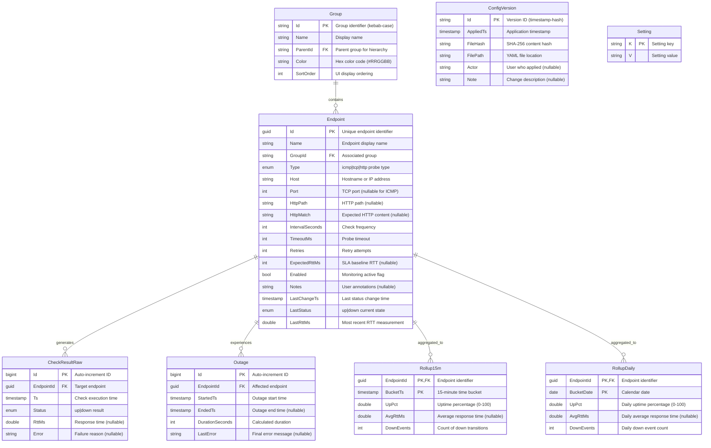

# ThingConnect Pulse - Entity Relationship Diagram

This document provides the visual ERD for the ThingConnect Pulse data model.

## Entity Relationship Diagram



## Table Relationships

### Core Monitoring Hierarchy

**Group → Endpoint (1:N)**
- Groups organize endpoints for dashboard display
- Supports nested hierarchy via `Group.ParentId` self-reference
- Cascade delete restricted to prevent data loss

**Endpoint → CheckResultRaw (1:N)**
- Raw probe results stored for each endpoint
- High-volume table with time-based retention
- Indexed on `(EndpointId, Ts)` for efficient queries

**Endpoint → Outage (1:N)**
- Tracks down periods detected by flap damping
- `EndedTs IS NULL` indicates ongoing outage
- Indexed for outage duration and SLA reporting

### Aggregation Relationships

**Endpoint → Rollup15m (1:N)**
- 15-minute aggregations for dashboard charts  
- Composite primary key on `(EndpointId, BucketTs)`
- Generated from CheckResultRaw watermark processing

**Endpoint → RollupDaily (1:N)**
- Daily aggregations for trend analysis
- Composite primary key on `(EndpointId, BucketDate)`
- Generated from Rollup15m data for efficiency

### Configuration Management

**ConfigVersion (Independent)**
- Tracks all YAML configuration changes
- Links to snapshot files via `FilePath`
- Enables configuration history and rollback

**Setting (Independent)**
- Key-value store for application settings
- Used for watermarks, feature flags, etc.
- Simple string-based storage

## Key Indexes Strategy

### Performance-Critical Indexes

```sql
-- Raw check queries (most frequent)
CREATE INDEX ix_check_result_raw_endpoint_ts 
ON check_result_raw(endpoint_id, ts);

-- Down-event detection (outage processing)
CREATE INDEX ix_raw_down_only 
ON check_result_raw(endpoint_id, ts) 
WHERE status = 'down';  -- PostgreSQL only

-- Outage queries by endpoint and time
CREATE INDEX ix_outage_endpoint_started 
ON outage(endpoint_id, started_ts);

CREATE INDEX ix_outage_endpoint_ended 
ON outage(endpoint_id, ended_ts);

-- Rollup time-range queries
CREATE INDEX ix_rollup_15m_bucket 
ON rollup_15m(bucket_ts);

CREATE INDEX ix_rollup_daily_bucket 
ON rollup_daily(bucket_date);

-- Configuration history
CREATE INDEX ix_config_version_applied 
ON config_version(applied_ts);
```

### Composite Key Rationale

**Rollup15m: (EndpointId, BucketTs)**
- Natural composite key for time-series data
- Efficient range queries for endpoint charts
- Prevents duplicate aggregations

**RollupDaily: (EndpointId, BucketDate)**  
- Date-based partitioning for long-term data
- Efficient monthly/yearly rollup queries
- SQLite uses string conversion for DateOnly

## Data Volume Estimates

### Storage Projections (1000 Endpoints)

**CheckResultRaw** (60-day retention):
- 10-second intervals: 8.64M records/day
- 60 days: ~518M records, ~52GB
- Index overhead: ~15GB

**Outage** (assuming 99.9% uptime):
- ~1 outage per endpoint per month
- 1000 endpoints: ~1000 outages/month
- 3 years retention: ~36K records, <10MB

**Rollup15m** (1-year retention):
- 96 buckets/day per endpoint
- 1000 endpoints × 365 days: ~35M records, ~3.5GB

**RollupDaily** (3-year retention):
- 1 record/day per endpoint
- 1000 endpoints × 1095 days: ~1.1M records, ~110MB

### Growth Rate Analysis

**Linear Growth**: Proportional to endpoint count
- 100 endpoints: ~5GB total
- 1000 endpoints: ~50GB total  
- 10000 endpoints: ~500GB total

**Time-Based Growth**: Raw data dominates
- CheckResultRaw: 70-80% of total storage
- Rollups: 15-20% of total storage
- Configuration/Metadata: <5%

## Provider-Specific Considerations

### SQLite Schema Features

**DateOnly Conversion**:
```csharp
// Required for RollupDaily.BucketDate
var dateOnlyToString = new ValueConverter<DateOnly, string>(
    d => d.ToString("yyyy-MM-dd"), 
    s => DateOnly.Parse(s));
```

**No Partial Indexes**:
- Full indexes used instead of filtered
- Application-level filtering for down events
- Higher storage overhead but acceptable for v1

**Foreign Key Enforcement**:
```sql
PRAGMA foreign_keys = ON;  -- Must be enabled explicitly
```

### PostgreSQL Schema Optimizations

**Native DateOnly Support**:
```sql
-- Direct DATE type mapping
bucket_date DATE NOT NULL
```

**Advanced Indexing**:
```sql
-- Partial indexes for better performance
CREATE INDEX ix_raw_down_only 
ON check_result_raw(endpoint_id, ts) 
WHERE status = 'down';

-- Functional indexes for computed columns
CREATE INDEX ix_outage_duration 
ON outage((EXTRACT(epoch FROM ended_ts - started_ts)));
```

**Table Partitioning** (Future v2.x):
```sql
-- Partition large tables by time
CREATE TABLE check_result_raw (
    -- columns
) PARTITION BY RANGE (ts);

CREATE TABLE check_result_raw_2024_08 PARTITION OF check_result_raw
    FOR VALUES FROM ('2024-08-01') TO ('2024-09-01');
```

---

**Document Version**: 1.0  
**Last Updated**: 2025-08-25  
**Next Review**: 2025-11-25  
**Owner**: ThingConnect Development Team