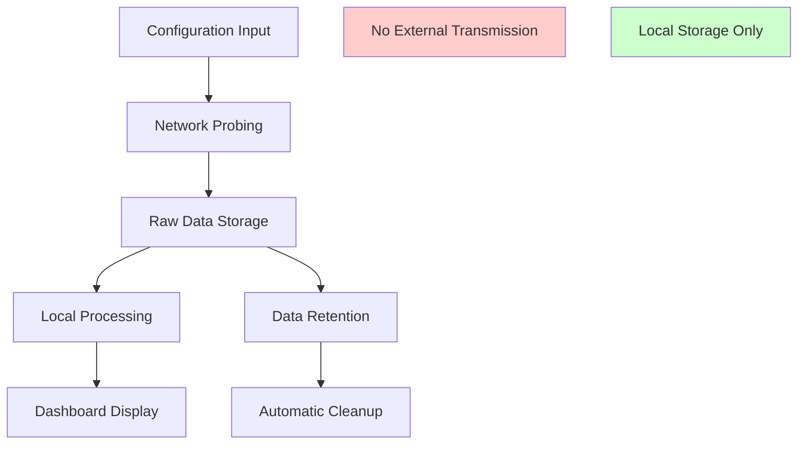

# ThingConnect Pulse - Privacy Policy & Data Practices

This document outlines the privacy principles, data collection practices, and telemetry policies for ThingConnect Pulse v1.

## Privacy Principles

ThingConnect Pulse is designed with **privacy-by-design** principles:

- **Local data storage** - All monitoring data remains on-premises
- **No cloud transmission** - No data sent to external services
- **Minimal data collection** - Only technical metrics necessary for monitoring
- **No personal information** - System focuses on network infrastructure
- **Transparent practices** - Open documentation of all data handling

## Data Collection & Processing

### What Data is Collected

**Network Monitoring Data**:
- Target hostnames and IP addresses (configured by user)
- Response times and availability status
- Error messages from failed network connections
- Timestamps of all monitoring checks

**System Operational Data**:
- Application logs (errors, warnings, operational events)
- Performance metrics (check execution times)
- Configuration change history
- Service health status

**What Data is NOT Collected**:
- User personal information or credentials
- Content from HTTP responses (beyond availability check)
- Network traffic content or payloads
- User behavior or interaction analytics
- Location data beyond configured IP addresses

### Data Storage Location

**Local Storage Only**:
- **Database**: `%ProgramData%\ThingConnect.Pulse\pulse.db`
- **Configuration**: `%ProgramData%\ThingConnect.Pulse\config\`
- **Logs**: `%ProgramData%\ThingConnect.Pulse\logs\`
- **Versions**: `%ProgramData%\ThingConnect.Pulse\versions\`

**Access Control**:
- Files protected by Windows file system permissions
- Only Local System service account and Administrators have full access
- Regular users have read-only access to program files

### Data Retention

**Default Retention Periods**:
- **Raw check results**: 60 days (configurable)
- **15-minute rollups**: 1 year (configurable)
- **Daily rollups**: Permanent retention
- **Outage records**: Permanent retention
- **Configuration history**: Permanent retention
- **Application logs**: 30 days (configurable)

**Data Cleanup**:
- Automated cleanup runs daily at 02:00 UTC
- Old data permanently deleted, not archived
- No data recovery after cleanup completes

## Telemetry & Analytics

### Current State (v1.0)

**No telemetry currently implemented**:
- No usage statistics collected
- No crash reports sent
- No feature usage tracking
- No update notifications

**Local logging only**:
- Application events logged to local files
- No network transmission of logs
- Logs contain only operational information

### Planned Telemetry (v1.1+)

**Opt-in telemetry model** being considered for future versions:

**Potential Optional Data Collection**:
- Anonymous usage statistics (endpoint counts, probe types)
- Anonymous crash reports (stack traces, error messages)
- Anonymous performance metrics (response times, throughput)
- Anonymous configuration patterns (probe intervals, timeout values)

**Telemetry Principles** (if implemented):
- **Explicit opt-in** required during setup
- **Granular control** over data types shared
- **Anonymous data only** - no identifying information
- **Minimal data** - only essential for product improvement
- **Clear disclosure** - transparent about all data collected

**Implementation Requirements**:
- User consent UI in setup wizard
- Configuration options to disable/enable telemetry
- Clear "About" page disclosure of telemetry status
- Option to review data before transmission

### Data Sharing & Third Parties

**No third-party data sharing in any version**:
- No data sold or shared with commercial partners
- No advertising or marketing use of data
- No data brokers or analytics services
- No social media integrations

**Future exception scenarios** (with explicit consent):
- Crash reports to improve stability (opt-in only)
- Anonymous usage statistics for product development (opt-in only)
- Technical support diagnostics (explicit request only)

## User Rights & Control

### Data Access

**Local access always available**:
- Users can directly access SQLite database files
- Configuration files in human-readable YAML format
- Log files in structured text format
- No proprietary data formats or encryption

**Export capabilities**:
- CSV export of all monitoring data
- Configuration export in YAML format
- Backup/restore functionality for all data

### Data Modification

**User control over collected data**:
- Add/remove monitoring endpoints via configuration
- Modify retention periods via settings
- Delete historical data via admin interface
- Clear logs and reset database if needed

### Data Portability

**Open data formats**:
- SQLite database (industry standard)
- YAML configuration files (human-readable)
- CSV export for analysis tools
- JSON API for programmatic access

**Migration support**:
- Database schema documented and versioned
- Import/export tools for data migration
- No vendor lock-in or proprietary formats

## Legal Compliance

### Applicable Regulations

**Data Protection Laws**:
Since ThingConnect Pulse typically monitors infrastructure (not personal data):
- **GDPR compliance**: Not applicable (no personal data processing)
- **CCPA compliance**: Not applicable (no consumer personal information)
- **PIPEDA compliance**: Not applicable (no personal information)

**Industry Regulations**:
- **HIPAA**: Not applicable (no health information)
- **SOX**: May be relevant for financial sector deployments
- **IEC 62443**: Industrial security standards compliance

### Legal Basis for Processing

**Network monitoring is typically**:
- **Legitimate business interest** for operational monitoring
- **Necessary for service delivery** in manufacturing environments
- **Authorized by system administrators** in enterprise deployments

### Data Subject Rights

**For organizations deploying ThingConnect Pulse**:
- Document monitoring activities in privacy impact assessments
- Ensure monitoring targets are within authorized scope
- Maintain data processing records if required by local law
- Respect employee privacy rights in workplace monitoring

## Privacy by Design Implementation

### Technical Safeguards

**Data Minimization**:
- Collect only essential networking metrics
- No unnecessary personal data collection
- Automatic data expiration based on retention policies
- Configurable data collection scope

**Purpose Limitation**:
- Data used only for network monitoring purposes
- No secondary use for marketing or analytics
- Clear functional boundaries on data usage
- Technical controls prevent misuse

**Storage Limitation**:
- Automatic deletion of expired data
- Configurable retention periods
- No indefinite data storage
- Regular cleanup processes

### Procedural Safeguards

**Transparency**:
- Open source documentation of data practices
- Clear privacy policy available in product
- Regular privacy documentation updates
- User education about data collection

**Accountability**:
- Privacy impact assessment documentation
- Regular privacy practice reviews
- Change management for privacy-affecting updates
- Privacy considerations in development process

## Privacy Risk Assessment

### Low Risk Activities

**Technical monitoring data**:
- IP addresses and hostnames (infrastructure identifiers)
- Response times and availability metrics
- Error messages from network protocols
- System performance data

### Medium Risk Considerations

**Potential privacy concerns**:
- Hostnames might reveal organizational structure
- Monitoring patterns could indicate business operations
- Error messages might contain sensitive path information
- Timestamp patterns could reveal usage schedules

**Mitigation strategies**:
- Clear administrative policies on monitoring scope
- Regular review of monitored endpoints
- Sanitization of error messages in logs
- Access controls on monitoring data

### Privacy Training & Awareness

**For deployment teams**:
- Understanding of local privacy laws
- Best practices for monitoring scope definition
- Proper handling of monitoring data
- Incident response for privacy breaches

## Contact & Governance

### Privacy Officer

**Internal privacy inquiries**:
- Document owner: ThingConnect Development Team
- Technical questions: [To be defined]
- Legal questions: [Organization legal counsel]

### Policy Updates

**Change management**:
- Privacy policy version control
- Impact assessment for privacy-affecting changes
- User notification of material privacy changes
- Regular policy review and updates

### Incident Response

**Privacy incident handling**:
- Data breach notification procedures
- Affected user communication protocols
- Regulatory reporting requirements
- Technical remediation procedures

## Future Privacy Enhancements

### v1.1 Planned Features

**Enhanced user control**:
- Granular data retention settings
- Data export improvements  
- Privacy dashboard in UI
- Telemetry opt-in interface

### v2.0 Planned Features

**Advanced privacy features**:
- Data anonymization options
- Differential privacy for metrics
- Enhanced data purging capabilities
- Privacy-preserving analytics

### Long-term Vision

**Privacy leadership**:
- Industry best practices adoption
- Privacy-by-design certification
- Regular third-party privacy audits
- Continuous privacy improvement

## Appendix: Technical Implementation

### Data Flow Diagram



### Privacy Configuration Options

```json
{
  "Privacy": {
    "DataRetention": {
      "RawDataDays": 60,
      "RollupDataDays": 365,
      "LogRetentionDays": 30
    },
    "Telemetry": {
      "Enabled": false,
      "OptInRequired": true,
      "DataTypes": []
    },
    "DataMinimization": {
      "SanitizeErrorMessages": true,
      "RemovePersonalPaths": true,
      "LimitHostnameLogging": false
    }
  }
}
```

### Compliance Checklist

**Pre-deployment privacy review**:
- [ ] Identify all data types collected
- [ ] Assess legal basis for processing
- [ ] Document retention periods
- [ ] Review data access controls
- [ ] Confirm no external data transmission
- [ ] Validate privacy policy accuracy

**Ongoing privacy maintenance**:
- [ ] Monitor data collection scope
- [ ] Review retention policy effectiveness
- [ ] Audit access logs regularly
- [ ] Update privacy documentation
- [ ] Train administrators on privacy practices

---

**Document Version**: 1.0  
**Last Updated**: 2025-08-25  
**Next Review**: 2025-11-25  
**Owner**: ThingConnect Development Team