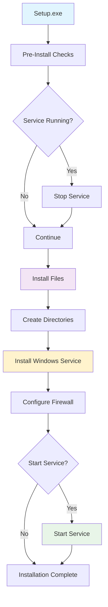

# ThingConnect Pulse - Installer & Deployment Specification

This document defines the complete Windows installer layout, service configuration, directory structure, and deployment procedures for ThingConnect Pulse.

## Installer Overview

ThingConnect Pulse uses **Inno Setup** to create a comprehensive Windows installer:



## Directory Structure

### Program Files Layout
```
C:\Program Files\ThingConnect.Pulse\
├── bin\
│   ├── ThingConnect.Pulse.Server.exe          # Main application
│   ├── ThingConnect.Pulse.Service.exe         # Windows Service wrapper
│   ├── appsettings.json                       # Base configuration
│   ├── appsettings.Production.json            # Production overrides
│   └── [All .NET runtime dependencies]        # Framework libraries
├── docs\
│   ├── README.md                              # Getting started guide
│   ├── LICENSE.txt                            # Software license
│   ├── CHANGELOG.md                           # Version history
│   └── UserGuide.pdf                         # Complete user documentation
└── unins000.exe                               # Inno Setup uninstaller
```

### Data Directory Layout
```
C:\ProgramData\ThingConnect.Pulse\
├── config\
│   ├── pulse.yaml                             # User monitoring configuration
│   ├── appsettings.local.json                 # Local overrides
│   └── .last-applied-hash                     # Configuration state tracking
├── data\
│   ├── pulse.db                               # SQLite database
│   ├── pulse.db-wal                           # SQLite WAL file
│   ├── pulse.db-shm                           # SQLite shared memory
│   └── backups\
│       ├── pulse-backup-20240825.db          # Automatic backups
│       └── [Additional backup files]
├── logs\
│   ├── pulse-20240825.log                     # Daily log files
│   ├── pulse-service-20240825.log             # Service-specific logs
│   └── [Rolled log files]
├── versions\
│   ├── 20240825_143052_a7b8c9d0.yaml         # Configuration version snapshots
│   └── [Additional version snapshots]
└── temp\
    ├── config-validate.tmp                    # Temporary validation files
    └── [Other temporary files]
```

### Registry Entries
```
HKEY_LOCAL_MACHINE\SYSTEM\CurrentControlSet\Services\ThingConnectPulse\
├── Type = REG_DWORD: 0x10 (SERVICE_WIN32_OWN_PROCESS)
├── Start = REG_DWORD: 0x2 (SERVICE_AUTO_START)
├── ErrorControl = REG_DWORD: 0x1 (SERVICE_ERROR_NORMAL)
├── ImagePath = REG_EXPAND_SZ: "C:\Program Files\ThingConnect.Pulse\bin\ThingConnect.Pulse.Service.exe"
├── DisplayName = REG_SZ: "ThingConnect Pulse Network Monitoring"
├── Description = REG_SZ: "Monitors network availability for manufacturing sites"
└── ObjectName = REG_SZ: "LocalSystem"

HKEY_LOCAL_MACHINE\SOFTWARE\ThingConnect\Pulse\
├── InstallPath = REG_SZ: "C:\Program Files\ThingConnect.Pulse"
├── DataPath = REG_SZ: "C:\ProgramData\ThingConnect.Pulse"
├── Version = REG_SZ: "1.0.0"
└── InstallDate = REG_SZ: "2024-08-25T14:30:00Z"
```

## Windows Service Configuration

### Service Properties

**Service Identity**:
- **Service Name**: `ThingConnectPulse`
- **Display Name**: `ThingConnect Pulse Network Monitoring`
- **Description**: `Monitors network availability for manufacturing sites`
- **Service Type**: `SERVICE_WIN32_OWN_PROCESS`
- **Account**: `Local System`

**Startup Configuration**:
- **Start Type**: `Automatic` (starts with Windows)
- **Error Control**: `Normal` (log errors, continue boot)
- **Dependencies**: None (independent service)
- **Recovery**: Restart service on failure (3 attempts)

**Service Implementation**:
```csharp
// ThingConnect.Pulse.Service.exe wrapper
public sealed class PulseWindowsService : BackgroundService
{
    private readonly IHost _applicationHost;
    
    public PulseWindowsService(IServiceProvider serviceProvider)
    {
        // Create hosted application instance
        _applicationHost = Host.CreateDefaultBuilder()
            .ConfigureServices(services =>
            {
                services.AddPulseServices();
                services.AddMonitoringServices();
            })
            .Build();
    }
    
    protected override async Task ExecuteAsync(CancellationToken stoppingToken)
    {
        await _applicationHost.RunAsync(stoppingToken);
    }
    
    public override async Task StopAsync(CancellationToken cancellationToken)
    {
        await _applicationHost.StopAsync(cancellationToken);
        _applicationHost.Dispose();
        await base.StopAsync(cancellationToken);
    }
}
```

### Service Management Commands

**Installation** (via installer):
```batch
sc create ThingConnectPulse ^
   binPath="C:\Program Files\ThingConnect.Pulse\bin\ThingConnect.Pulse.Service.exe" ^
   displayName="ThingConnect Pulse Network Monitoring" ^
   description="Monitors network availability for manufacturing sites" ^
   start=auto ^
   obj=LocalSystem
```

**Manual Control**:
```batch
# Start service
sc start ThingConnectPulse
net start ThingConnectPulse

# Stop service  
sc stop ThingConnectPulse
net stop ThingConnectPulse

# Query status
sc query ThingConnectPulse

# Change configuration
sc config ThingConnectPulse start=demand
```

**PowerShell Management**:
```powershell
# Service status
Get-Service -Name ThingConnectPulse

# Start/Stop
Start-Service -Name ThingConnectPulse
Stop-Service -Name ThingConnectPulse

# Service properties
Get-WmiObject -Class Win32_Service -Filter "Name='ThingConnectPulse'"
```

## Inno Setup Configuration

### Setup Script Structure

**Main Setup File** (`setup.iss`):
```inno
[Setup]
AppId={{8B2C4D6E-9A1F-4B3C-8E5D-2A7C9F1E4B6D}
AppName=ThingConnect Pulse
AppVersion=1.0.0
AppPublisher=ThingConnect Development Team
AppPublisherURL=https://github.com/MachDatum/ThingConnect.Pulse
AppSupportURL=https://github.com/MachDatum/ThingConnect.Pulse/issues
DefaultDirName={pf}\ThingConnect.Pulse
DefaultGroupName=ThingConnect Pulse
OutputBaseFilename=ThingConnect.Pulse.Setup.{#AppVersion}
OutputDir=dist
SetupIconFile=assets\pulse-icon.ico
Compression=lzma2
SolidCompression=yes
PrivilegesRequired=admin
ArchitecturesInstallIn64BitMode=x64
MinVersion=10.0.17763
```

**File Installation**:
```inno
[Files]
; Application binaries
Source: "bin\*"; DestDir: "{app}\bin"; Flags: ignoreversion recursesubdirs

; Documentation
Source: "docs\*"; DestDir: "{app}\docs"; Flags: ignoreversion recursesubdirs

; Default configuration
Source: "config\pulse.yaml.template"; DestDir: "{commonappdata}\ThingConnect.Pulse\config"; DestName: "pulse.yaml"; Flags: onlyifdoesntexist

; License and readme
Source: "LICENSE.txt"; DestDir: "{app}"; Flags: ignoreversion
Source: "README.md"; DestDir: "{app}"; Flags: ignoreversion
```

**Directory Creation**:
```inno
[Dirs]
Name: "{commonappdata}\ThingConnect.Pulse\config"; Permissions: everyone-modify
Name: "{commonappdata}\ThingConnect.Pulse\data"; Permissions: everyone-modify
Name: "{commonappdata}\ThingConnect.Pulse\logs"; Permissions: everyone-modify
Name: "{commonappdata}\ThingConnect.Pulse\versions"; Permissions: everyone-modify
Name: "{commonappdata}\ThingConnect.Pulse\temp"; Permissions: everyone-modify
Name: "{commonappdata}\ThingConnect.Pulse\data\backups"; Permissions: everyone-modify
```

**Service Installation**:
```inno
[Run]
; Install and start Windows service
Filename: "{sys}\sc.exe"; Parameters: "create ThingConnectPulse binPath=""{app}\bin\ThingConnect.Pulse.Service.exe"" displayName=""ThingConnect Pulse Network Monitoring"" description=""Monitors network availability for manufacturing sites"" start=auto obj=LocalSystem"; Flags: runhidden
Filename: "{sys}\sc.exe"; Parameters: "start ThingConnectPulse"; Flags: runhidden postinstall skipifsilent; Description: "Start ThingConnect Pulse service"

[UninstallRun]
; Stop and remove Windows service
Filename: "{sys}\sc.exe"; Parameters: "stop ThingConnectPulse"; Flags: runhidden
Filename: "{sys}\sc.exe"; Parameters: "delete ThingConnectPulse"; Flags: runhidden
```

### Installation Options & UI

**Setup Wizard Pages**:
1. **Welcome Page**: Product introduction and requirements
2. **License Agreement**: Software license acceptance
3. **Installation Directory**: Custom installation path option
4. **Service Configuration**: Service startup options
5. **Firewall Configuration**: Windows Firewall rule creation
6. **Ready to Install**: Summary of selected options
7. **Installation Progress**: File copying and configuration
8. **Completion**: Service status and next steps

**Custom Setup Options**:
```inno
[Components]
Name: "core"; Description: "Core Application Files"; Types: full compact custom; Flags: fixed
Name: "service"; Description: "Windows Service"; Types: full compact custom; Flags: fixed  
Name: "docs"; Description: "Documentation"; Types: full
Name: "samples"; Description: "Sample Configuration"; Types: full
Name: "firewall"; Description: "Windows Firewall Rule"; Types: full custom

[Types]
Name: "full"; Description: "Full installation"
Name: "compact"; Description: "Compact installation"
Name: "custom"; Description: "Custom installation"; Flags: iscustom
```

**Installation Prerequisites**:
```inno
[Code]
function InitializeSetup(): Boolean;
var
  Version: TWindowsVersion;
  NetFrameworkVersion: Cardinal;
begin
  GetWindowsVersionEx(Version);
  
  // Check Windows version (Windows 10 1809+ / Server 2019+)
  if (Version.Major < 10) or 
     ((Version.Major = 10) and (Version.Build < 17763)) then
  begin
    MsgBox('This application requires Windows 10 version 1809 or later, or Windows Server 2019 or later.', 
           mbError, MB_OK);
    Result := False;
    Exit;
  end;
  
  // Check .NET 8.0 Runtime
  if not IsDotNetInstalled(net80, 0) then
  begin
    if MsgBox('This application requires .NET 8.0 Runtime. Would you like to download it now?', 
              mbConfirmation, MB_YESNO) = IDYES then
    begin
      ShellExec('open', 'https://dotnet.microsoft.com/download/dotnet/8.0', '', '', SW_SHOW, ewNoWait, NetFrameworkVersion);
    end;
    Result := False;
    Exit;
  end;
  
  Result := True;
end;
```

## Firewall Configuration

### Windows Firewall Rules

**Inbound Rule Creation**:
```batch
# Allow HTTP traffic on port 8080
netsh advfirewall firewall add rule ^
    name="ThingConnect Pulse HTTP" ^
    dir=in ^
    action=allow ^
    protocol=TCP ^
    localport=8080 ^
    program="C:\Program Files\ThingConnect.Pulse\bin\ThingConnect.Pulse.Server.exe"
```

**Outbound Rules** (Optional):
```batch
# Allow outbound ICMP for ping probes
netsh advfirewall firewall add rule ^
    name="ThingConnect Pulse ICMP" ^
    dir=out ^
    action=allow ^
    protocol=ICMPv4

# Allow outbound HTTP/HTTPS for web probes
netsh advfirewall firewall add rule ^
    name="ThingConnect Pulse HTTP Probes" ^
    dir=out ^
    action=allow ^
    protocol=TCP ^
    remoteport=80,443
```

**Firewall Setup in Installer**:
```inno
[Code]
procedure ConfigureFirewall();
var
  ResultCode: Integer;
begin
  // Add inbound rule for HTTP port 8080
  Exec('netsh', 'advfirewall firewall add rule name="ThingConnect Pulse HTTP" dir=in action=allow protocol=TCP localport=8080 program="' + ExpandConstant('{app}\bin\ThingConnect.Pulse.Server.exe') + '"', '', SW_HIDE, ewWaitUntilTerminated, ResultCode);
  
  if ResultCode <> 0 then
    Log('Failed to create firewall rule: ' + IntToStr(ResultCode));
end;
```

## File Permissions & Security

### Access Control Lists (ACLs)

**Program Files Security**:
```
C:\Program Files\ThingConnect.Pulse\
├── Administrators: Full Control
├── SYSTEM: Full Control  
├── Users: Read & Execute
└── TrustedInstaller: Full Control
```

**Data Directory Security**:
```
C:\ProgramData\ThingConnect.Pulse\
├── Administrators: Full Control
├── SYSTEM: Full Control
├── Users: Read & Execute (config and logs only)
└── Local Service: Read & Write (if service runs as Local Service)
```

**Service Account Permissions**:
- **Local System**: Full access to all application files and data
- **Log on as a service**: Granted automatically during service installation
- **Network access**: Required for monitoring probes (ICMP, TCP, HTTP)
- **File system access**: Read program files, full access to data directory

### Security Hardening

**Service Isolation**:
```inno
[Run]
; Configure service for security
Filename: "{sys}\sc.exe"; Parameters: "config ThingConnectPulse type= own"; Flags: runhidden
Filename: "{sys}\sc.exe"; Parameters: "config ThingConnectPulse error= normal"; Flags: runhidden
Filename: "{sys}\sc.exe"; Parameters: "failure ThingConnectPulse reset= 300 actions= restart/5000/restart/5000/restart/10000"; Flags: runhidden
```

**Registry Security**:
```
HKEY_LOCAL_MACHINE\SOFTWARE\ThingConnect\Pulse\
├── Administrators: Full Control
├── SYSTEM: Full Control
└── Users: Read
```

## Installation Modes & Options

### Silent Installation

**Unattended Installation**:
```batch
# Basic silent install
ThingConnect.Pulse.Setup.exe /SILENT

# Silent install with custom directory
ThingConnect.Pulse.Setup.exe /SILENT /DIR="C:\Custom\Path"

# Silent install without starting service
ThingConnect.Pulse.Setup.exe /SILENT /TASKS="!startservice"

# Full silent install with all options
ThingConnect.Pulse.Setup.exe /VERYSILENT /SUPPRESSMSGBOXES /NORESTART
```

**Command Line Parameters**:
```inno
[Setup]
; Support command line customization
SetupLogging=yes
ShowLanguageDialog=auto
UsePreviousAppDir=yes
UsePreviousGroup=yes
UsePreviousSetupType=yes
UsePreviousTasks=yes
```

### Enterprise Deployment

**MSI Transform Support** (Future):
```batch
# Generate MSI for enterprise deployment
iscc setup.iss /DMSI_BUILD
msiexec /i ThingConnect.Pulse.Setup.msi /quiet INSTALLDIR="C:\Programs\Pulse"
```

**Group Policy Deployment**:
- MSI package compatible with Active Directory deployment
- Registry settings configurable via Group Policy
- Service configuration manageable via Group Policy
- Logging and monitoring integration with enterprise tools

## Upgrade & Maintenance Procedures

### In-Place Upgrade Process

**Upgrade Detection**:
```inno
[Code]
function ShouldSkipPage(PageID: Integer): Boolean;
var
  InstalledVersion: String;
  CurrentVersion: String;
begin
  if PageID = wpSelectDir then
  begin
    // Check if already installed
    if RegQueryStringValue(HKEY_LOCAL_MACHINE, 'SOFTWARE\ThingConnect\Pulse', 'Version', InstalledVersion) then
    begin
      CurrentVersion := '{#AppVersion}';
      if CompareVersion(CurrentVersion, InstalledVersion) <= 0 then
      begin
        MsgBox('Version ' + InstalledVersion + ' or newer is already installed.', mbInformation, MB_OK);
        Result := True;
        Exit;
      end;
    end;
  end;
  Result := False;
end;
```

**Data Preservation**:
```inno
[Code]
procedure BackupUserData();
var
  BackupPath: String;
  DataPath: String;
begin
  DataPath := ExpandConstant('{commonappdata}\ThingConnect.Pulse\data');
  BackupPath := ExpandConstant('{commonappdata}\ThingConnect.Pulse\data\backups\upgrade-backup-{#AppVersion}.db');
  
  if FileExists(DataPath + '\pulse.db') then
  begin
    FileCopy(DataPath + '\pulse.db', BackupPath, False);
    Log('Created upgrade backup: ' + BackupPath);
  end;
end;
```

### Uninstallation Process

**Clean Removal**:
```inno
[UninstallDelete]
Type: files; Name: "{commonappdata}\ThingConnect.Pulse\temp\*"
Type: dirifempty; Name: "{commonappdata}\ThingConnect.Pulse\temp"

[Code]  
procedure CurUninstallStepChanged(CurUninstallStep: TUninstallStep);
begin
  if CurUninstallStep = usPostUninstall then
  begin
    // Optional: Remove user data
    if MsgBox('Do you want to remove all monitoring data and configuration?', 
              mbConfirmation, MB_YESNO) = IDYES then
    begin
      RemoveDir(ExpandConstant('{commonappdata}\ThingConnect.Pulse'), True);
    end;
    
    // Clean up registry
    RegDeleteKeyIncludingSubkeys(HKEY_LOCAL_MACHINE, 'SOFTWARE\ThingConnect\Pulse');
  end;
end;
```

---

**Document Version**: 1.0  
**Last Updated**: 2025-08-25  
**Next Review**: 2025-11-25  
**Owner**: ThingConnect Development Team