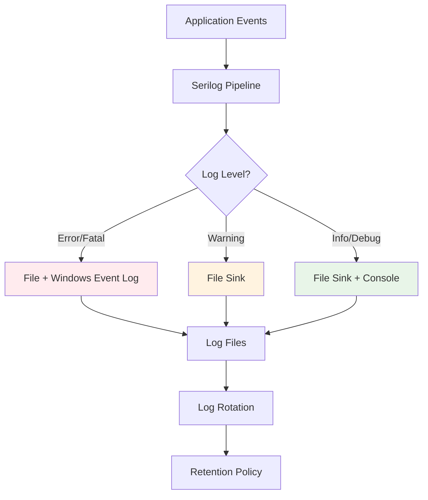

# ThingConnect Pulse - Logging Specification

This document defines the logging strategy, configuration, retention policies, and structured logging format for ThingConnect Pulse.

## Logging Overview

ThingConnect Pulse uses **Serilog** with structured logging for comprehensive observability:



## Log Configuration

### Serilog Configuration

**appsettings.json Configuration**:
```json
{
  "Serilog": {
    "Using": ["Serilog.Sinks.Console", "Serilog.Sinks.File", "Serilog.Sinks.EventLog"],
    "MinimumLevel": {
      "Default": "Information",
      "Override": {
        "Microsoft": "Warning",
        "Microsoft.Hosting.Lifetime": "Information",
        "Microsoft.EntityFrameworkCore": "Warning",
        "System": "Warning"
      }
    },
    "WriteTo": [
      {
        "Name": "Console",
        "Args": {
          "outputTemplate": "[{Timestamp:HH:mm:ss} {Level:u3}] {SourceContext}: {Message:lj}{NewLine}{Exception}"
        }
      },
      {
        "Name": "File",
        "Args": {
          "path": "%ProgramData%\\ThingConnect.Pulse\\logs\\pulse-.log",
          "rollingInterval": "Day",
          "retainedFileCountLimit": 30,
          "fileSizeLimitBytes": 10485760,
          "rollOnFileSizeLimit": true,
          "outputTemplate": "{Timestamp:yyyy-MM-dd HH:mm:ss.fff zzz} [{Level:u3}] [{SourceContext}] {Message:lj}{NewLine}{Exception}",
          "shared": true
        }
      },
      {
        "Name": "EventLog",
        "Args": {
          "source": "ThingConnect Pulse",
          "logName": "Application",
          "restrictedToMinimumLevel": "Warning",
          "outputTemplate": "{Message:lj}{NewLine}{Exception}"
        }
      }
    ],
    "Enrich": ["FromLogContext", "WithMachineName", "WithProcessId", "WithThreadId"],
    "Properties": {
      "Application": "ThingConnect.Pulse",
      "Environment": "Production"
    }
  }
}
```

### Environment-Specific Overrides

**Development** (`appsettings.Development.json`):
```json
{
  "Serilog": {
    "MinimumLevel": {
      "Default": "Debug",
      "Override": {
        "ThingConnect.Pulse.Services.MonitoringService": "Debug",
        "ThingConnect.Pulse.Services.ProbeService": "Debug"
      }
    },
    "WriteTo": [
      {
        "Name": "Console",
        "Args": {
          "outputTemplate": "[{Timestamp:HH:mm:ss} {Level:u3}] {SourceContext:l}: {Message:lj}{NewLine}{Exception}"
        }
      },
      {
        "Name": "File",
        "Args": {
          "path": "logs\\pulse-dev-.log",
          "rollingInterval": "Day",
          "retainedFileCountLimit": 7,
          "outputTemplate": "{Timestamp:yyyy-MM-dd HH:mm:ss.fff} [{Level:u3}] [{SourceContext:l}] {Message:lj}{NewLine}{Exception}"
        }
      }
    ]
  }
}
```

**Production** (`appsettings.Production.json`):
```json
{
  "Serilog": {
    "MinimumLevel": {
      "Default": "Information",
      "Override": {
        "ThingConnect.Pulse.Services.ProbeService": "Warning"
      }
    },
    "WriteTo": [
      {
        "Name": "File",
        "Args": {
          "path": "%ProgramData%\\ThingConnect.Pulse\\logs\\pulse-.log",
          "rollingInterval": "Day",
          "retainedFileCountLimit": 60,
          "fileSizeLimitBytes": 50485760,
          "rollOnFileSizeLimit": true,
          "bufferSize": 32768,
          "flushToDiskInterval": "00:00:05"
        }
      },
      {
        "Name": "EventLog",
        "Args": {
          "source": "ThingConnect Pulse",
          "logName": "Application",
          "restrictedToMinimumLevel": "Error"
        }
      }
    ]
  }
}
```

## Log Categories & Levels

### Log Level Guidelines

**FATAL** - Application cannot continue:
```csharp
_logger.LogCritical("Database connection failed permanently: {Error}", ex.Message);
_logger.LogCritical("Service cannot start: required configuration missing");
```

**ERROR** - Application error but can continue:
```csharp
_logger.LogError(ex, "Failed to process configuration: {ConfigPath}", configPath);
_logger.LogError("Endpoint {EndpointId} probe failed: {Error}", endpointId, error);
```

**WARNING** - Potentially harmful situations:
```csharp
_logger.LogWarning("Endpoint {EndpointId} transitioning to DOWN after {Failures} failures", 
                  endpointId, failureCount);
_logger.LogWarning("Configuration validation warning: {Message}", validationMessage);
```

**INFORMATION** - General operational messages:
```csharp
_logger.LogInformation("Service starting with {EndpointCount} endpoints configured", count);
_logger.LogInformation("Configuration applied successfully: version {Version}", versionId);
```

**DEBUG** - Detailed diagnostic information:
```csharp
_logger.LogDebug("Probe {ProbeType} to {Host}:{Port} completed in {Duration}ms", 
                type, host, port, duration);
_logger.LogDebug("State transition: {EndpointId} from {OldState} to {NewState}", 
                endpointId, oldState, newState);
```

### Source Context Categories

**Core Services**:
- `ThingConnect.Pulse.Services.MonitoringService` - Main monitoring loop
- `ThingConnect.Pulse.Services.ProbeService` - Network probe execution
- `ThingConnect.Pulse.Services.OutageDetectionService` - State machine and outage tracking
- `ThingConnect.Pulse.Services.RollupService` - Data aggregation processing
- `ThingConnect.Pulse.Services.ConfigurationService` - Configuration management

**Background Services**:
- `ThingConnect.Pulse.BackgroundServices.MonitoringBackgroundService` - Background monitoring
- `ThingConnect.Pulse.BackgroundServices.RollupBackgroundService` - Rollup processing
- `ThingConnect.Pulse.BackgroundServices.CleanupBackgroundService` - Data retention

**API Controllers**:
- `ThingConnect.Pulse.Controllers.StatusController` - Status API endpoints
- `ThingConnect.Pulse.Controllers.ConfigController` - Configuration API
- `ThingConnect.Pulse.Controllers.HistoryController` - Historical data API

## Structured Logging Format

### Log Message Templates

**Monitoring Events**:
```csharp
// Probe execution
_logger.LogInformation("Probe completed: {ProbeType} to {Host}:{Port} - {Status} in {Duration}ms", 
                      probeType, host, port, status, duration);

// State changes
_logger.LogWarning("Endpoint state change: {EndpointName} ({EndpointId}) {OldStatus} → {NewStatus}", 
                  endpointName, endpointId, oldStatus, newStatus);

// Outage lifecycle
_logger.LogError("Outage started: {EndpointName} ({EndpointId}) - {Error}", 
                endpointName, endpointId, error);
_logger.LogInformation("Outage ended: {EndpointName} ({EndpointId}) - Duration: {Duration}s", 
                      endpointName, endpointId, durationSeconds);
```

**Configuration Events**:
```csharp
// Configuration changes
_logger.LogInformation("Configuration applied: {ConfigVersionId} - Added: {Added}, Updated: {Updated}, Removed: {Removed}", 
                      versionId, addedCount, updatedCount, removedCount);

// Validation events
_logger.LogWarning("Configuration validation warning: {Path} - {Message}", 
                  jsonPath, validationMessage);
```

**Performance Events**:
```csharp
// Background processing
_logger.LogInformation("Rollup processing completed: {ProcessedBuckets} buckets in {Duration}ms", 
                      bucketCount, duration);

// Database operations
_logger.LogDebug("Database query completed: {Query} in {Duration}ms, {RowCount} rows", 
                queryType, duration, rowCount);
```

## File Organization & Rotation

### File Naming Convention

**Standard Log Files**:
```
pulse-20240825.log          # Main application log for August 25, 2024
pulse-20240826.log          # Next day's log file
pulse-service-20240825.log  # Windows Service wrapper log (if separate)
```

**Archived Files** (when size limit exceeded):
```
pulse-20240825.log          # Current day's first file
pulse-20240825_001.log      # Second file after rotation
pulse-20240825_002.log      # Third file after rotation
```

### Rotation Policy

**Daily Rotation**:
- New log file created at midnight UTC
- Previous day's files retained based on retention policy
- File size limit triggers additional rotation within same day

**Size-Based Rotation**:
- **Development**: 10MB per file (smaller for easier debugging)
- **Production**: 50MB per file (balance between size and rotation frequency)
- **Maximum files per day**: 10 (prevents runaway logging)

**Configuration**:
```csharp
Log.Logger = new LoggerConfiguration()
    .WriteTo.File(
        path: Path.Combine(logsDirectory, "pulse-.log"),
        rollingInterval: RollingInterval.Day,
        retainedFileCountLimit: 30, // Keep 30 days
        fileSizeLimitBytes: 50 * 1024 * 1024, // 50MB
        rollOnFileSizeLimit: true,
        shared: true, // Allow multiple processes
        flushToDiskInterval: TimeSpan.FromSeconds(5)
    )
    .CreateLogger();
```

## Log Retention & Cleanup

### Retention Policies

**Default Retention**:
- **Development**: 7 days (minimize disk usage)
- **Production**: 60 days (support troubleshooting and analysis)
- **Maximum retention**: 90 days (compliance with data retention policies)

**Configurable Retention**:
```json
{
  "Logging": {
    "Retention": {
      "DaysToKeep": 60,
      "MaxTotalSizeMB": 1000,
      "CleanupSchedule": "02:00:00"
    }
  }
}
```

### Automated Cleanup

**Cleanup Background Service**:
```csharp
public sealed class LogCleanupBackgroundService : BackgroundService
{
    private readonly ILogger<LogCleanupBackgroundService> _logger;
    private readonly IConfiguration _configuration;
    private readonly string _logsDirectory;
    
    protected override async Task ExecuteAsync(CancellationToken stoppingToken)
    {
        while (!stoppingToken.IsCancellationRequested)
        {
            try
            {
                await CleanupOldLogFilesAsync();
                
                // Run daily at 2 AM
                var nextRun = DateTime.Today.AddDays(1).AddHours(2);
                var delay = nextRun - DateTime.Now;
                
                if (delay > TimeSpan.Zero)
                    await Task.Delay(delay, stoppingToken);
                else
                    await Task.Delay(TimeSpan.FromHours(1), stoppingToken); // Retry in 1 hour
            }
            catch (Exception ex)
            {
                _logger.LogError(ex, "Error during log cleanup");
                await Task.Delay(TimeSpan.FromHours(1), stoppingToken);
            }
        }
    }
    
    private async Task CleanupOldLogFilesAsync()
    {
        var retentionDays = _configuration.GetValue<int>("Logging:Retention:DaysToKeep", 60);
        var cutoffDate = DateTime.UtcNow.AddDays(-retentionDays);
        
        var logFiles = Directory.GetFiles(_logsDirectory, "pulse-*.log")
                               .Where(f => File.GetCreationTimeUtc(f) < cutoffDate)
                               .ToList();
        
        foreach (var file in logFiles)
        {
            try
            {
                File.Delete(file);
                _logger.LogInformation("Deleted expired log file: {FileName}", Path.GetFileName(file));
            }
            catch (Exception ex)
            {
                _logger.LogWarning(ex, "Failed to delete log file: {FileName}", Path.GetFileName(file));
            }
        }
        
        if (logFiles.Count > 0)
        {
            _logger.LogInformation("Log cleanup completed: {DeletedCount} files removed", logFiles.Count);
        }
    }
}
```

## Windows Event Log Integration

### Event Log Configuration

**Event Source Registration** (via installer):
```batch
# Create event source during installation
eventcreate /ID 1000 /L APPLICATION /T INFORMATION /SO "ThingConnect Pulse" /D "ThingConnect Pulse service started successfully"
```

**Event Categories**:
- **Event ID 1000-1999**: Information events (service start/stop, configuration changes)
- **Event ID 2000-2999**: Warning events (endpoint state changes, validation warnings)
- **Event ID 3000-3999**: Error events (probe failures, database errors)
- **Event ID 4000-4999**: Critical events (service failures, fatal errors)

**Event Templates**:
```csharp
public static class EventIds
{
    // Information Events
    public static readonly EventId ServiceStarted = new(1001, "ServiceStarted");
    public static readonly EventId ConfigurationApplied = new(1002, "ConfigurationApplied");
    public static readonly EventId EndpointAdded = new(1003, "EndpointAdded");
    
    // Warning Events
    public static readonly EventId EndpointDown = new(2001, "EndpointDown");
    public static readonly EventId ConfigurationWarning = new(2002, "ConfigurationWarning");
    public static readonly EventId PerformanceWarning = new(2003, "PerformanceWarning");
    
    // Error Events
    public static readonly EventId ProbeError = new(3001, "ProbeError");
    public static readonly EventId DatabaseError = new(3002, "DatabaseError");
    public static readonly EventId ConfigurationError = new(3003, "ConfigurationError");
    
    // Critical Events
    public static readonly EventId ServiceFailed = new(4001, "ServiceFailed");
    public static readonly EventId DatabaseConnectionFailed = new(4002, "DatabaseConnectionFailed");
}

// Usage
_logger.LogInformation(EventIds.ServiceStarted, 
    "ThingConnect Pulse service started successfully with {EndpointCount} endpoints", 
    endpointCount);

_logger.LogWarning(EventIds.EndpointDown, 
    "Endpoint {EndpointName} is DOWN: {Error}", 
    endpointName, error);
```

### Event Log Filtering

**Production Event Log Policy**:
- Only WARNING and above written to Event Log
- Information events logged to file only
- Critical events immediately written to Event Log
- Event Log messages limited to 1000 characters

**PowerShell Event Log Queries**:
```powershell
# Get ThingConnect Pulse events from last 24 hours
Get-WinEvent -FilterHashtable @{
    LogName='Application'
    ProviderName='ThingConnect Pulse'
    StartTime=(Get-Date).AddDays(-1)
} | Select-Object TimeCreated, Id, LevelDisplayName, Message

# Get only error/warning events
Get-WinEvent -FilterHashtable @{
    LogName='Application'
    ProviderName='ThingConnect Pulse'
    Level=2,3  # Error=2, Warning=3
} | Format-Table TimeCreated, Id, LevelDisplayName, Message -Wrap
```

## Performance & Monitoring

### Log Performance Optimization

**Asynchronous Logging**:
```csharp
Log.Logger = new LoggerConfiguration()
    .WriteTo.Async(wt => wt.File(
        path: logPath,
        buffered: true,
        flushToDiskInterval: TimeSpan.FromSeconds(5)
    ))
    .CreateLogger();
```

**Conditional Logging**:
```csharp
// Expensive logging operations guarded by level check
if (_logger.IsEnabled(LogLevel.Debug))
{
    var diagnosticInfo = CollectDiagnosticInformation(); // Expensive operation
    _logger.LogDebug("Diagnostic info: {@DiagnosticInfo}", diagnosticInfo);
}
```

### Log Analysis & Monitoring

**Key Metrics to Monitor**:
- Log file growth rate (MB/day)
- Error/warning frequency trends
- Specific error pattern detection
- Performance degradation indicators

**Log Analysis Tools**:
- **PowerShell**: Built-in text processing and filtering
- **LogParser**: Microsoft tool for structured log analysis
- **Serilog structured logs**: Enable JSON output for machine parsing
- **Custom analysis scripts**: Tailored monitoring for specific patterns

**Sample Analysis Script**:
```powershell
# Analyze error patterns in last 7 days
$logFiles = Get-ChildItem "C:\ProgramData\ThingConnect.Pulse\logs" -Filter "pulse-*.log" | 
           Where-Object { $_.CreationTime -gt (Get-Date).AddDays(-7) }

$errorPattern = '\[ERR\].*Endpoint.*failed'
$errors = $logFiles | ForEach-Object { 
    Select-String -Path $_.FullName -Pattern $errorPattern 
}

$errors | Group-Object { ($_ -split ' ')[3] } | 
         Sort-Object Count -Descending | 
         Select-Object Name, Count | 
         Format-Table -AutoSize
```

## Troubleshooting & Diagnostics

### Log Levels for Troubleshooting

**Component-Specific Debug Logging**:
```json
{
  "Serilog": {
    "MinimumLevel": {
      "Override": {
        "ThingConnect.Pulse.Services.ProbeService": "Debug",
        "ThingConnect.Pulse.Services.OutageDetectionService": "Debug"
      }
    }
  }
}
```

**Diagnostic Log Collection**:
```csharp
public async Task<string> CreateDiagnosticBundleAsync()
{
    var timestamp = DateTime.UtcNow.ToString("yyyyMMdd-HHmmss");
    var bundlePath = Path.Combine(Path.GetTempPath(), $"pulse-diagnostics-{timestamp}.zip");
    
    using var archive = ZipFile.Open(bundlePath, ZipArchiveMode.Create);
    
    // Add recent log files
    var logFiles = Directory.GetFiles(_logsDirectory, "pulse-*.log")
                           .OrderByDescending(f => File.GetCreationTime(f))
                           .Take(7); // Last 7 days
    
    foreach (var logFile in logFiles)
    {
        archive.CreateEntryFromFile(logFile, Path.GetFileName(logFile));
    }
    
    // Add configuration
    var configFile = Path.Combine(_dataDirectory, "config", "pulse.yaml");
    if (File.Exists(configFile))
    {
        archive.CreateEntryFromFile(configFile, "config/pulse.yaml");
    }
    
    // Add system information
    var sysInfo = await CollectSystemInformationAsync();
    var sysInfoEntry = archive.CreateEntry("system-info.json");
    using var sysInfoStream = sysInfoEntry.Open();
    await JsonSerializer.SerializeAsync(sysInfoStream, sysInfo);
    
    return bundlePath;
}
```

---

**Document Version**: 1.0  
**Last Updated**: 2025-08-25  
**Next Review**: 2025-11-25  
**Owner**: ThingConnect Development Team