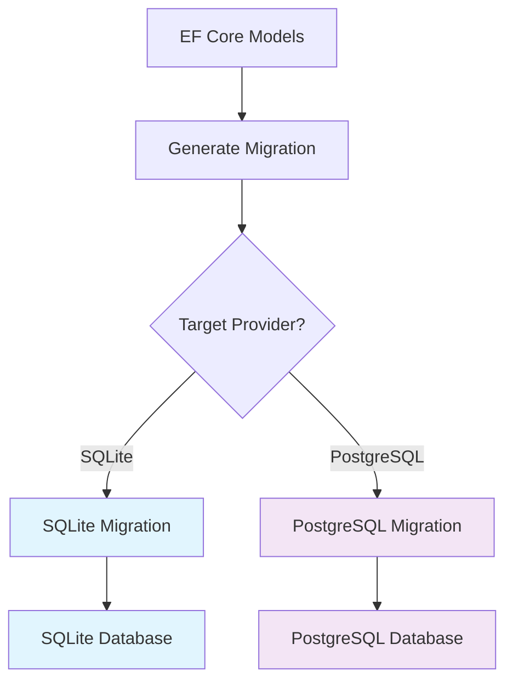

# ThingConnect Pulse - Database Migrations Plan

This document defines the migration strategy, provider-specific considerations, and deployment approach for ThingConnect Pulse v1.

## Migration Strategy Overview

ThingConnect Pulse uses **Entity Framework Core Code-First migrations** with dual-provider support:



## Provider Support Matrix

### SQLite (v1.0 Primary Target)

**Use Cases**:
- Manufacturing site deployments (edge/local)
- Development and testing environments
- Single-server installations

**Advantages**:
- Zero-maintenance embedded database
- File-based storage in `%ProgramData%\ThingConnect.Pulse\`
- No server process required
- ACID transactions with WAL journaling

**Limitations**:
- Single writer at a time
- Limited concurrent read performance
- No built-in replication
- DateOnly type requires string conversion

### PostgreSQL (v2.0 Future Target)

**Use Cases**:
- Enterprise deployments with centralized monitoring
- Multi-site installations with consolidated reporting
- High-availability requirements

**Advantages**:
- Full ACID compliance with high concurrency
- Advanced indexing and query optimization
- Built-in replication and high availability
- Native DateOnly support (date type)

**Limitations**:
- Requires separate database server process
- More complex deployment and maintenance
- Higher resource consumption

## Entity Framework Core Configuration

### Provider-Specific Model Configuration

```csharp
protected override void OnModelCreating(ModelBuilder b)
{
    var isSqlite = Database.ProviderName?.Contains("Sqlite", StringComparison.OrdinalIgnoreCase) == true;
    var dateOnlyToString = new ValueConverter<DateOnly, string>(
        d => d.ToString("yyyy-MM-dd"), 
        s => DateOnly.Parse(s));

    // SQLite-specific configurations
    if (isSqlite)
    {
        // DateOnly conversion required for SQLite
        b.Entity<RollupDaily>(e => 
        {
            e.Property(x => x.BucketDate).HasConversion(dateOnlyToString);
        });
    }
    
    // PostgreSQL-specific configurations  
    if (!isSqlite)
    {
        // Partial indexes supported in PostgreSQL
        b.Entity<CheckResultRaw>(e =>
        {
            e.HasIndex(x => new { x.EndpointId, x.Ts })
             .HasDatabaseName("ix_raw_down_only")
             .HasFilter("status = 'down'");
        });
    }
}
```

### Connection String Patterns

**SQLite Development**:
```json
{
  "ConnectionStrings": {
    "Database": "Data Source=pulse-dev.db;Cache=Shared"
  }
}
```

**SQLite Production**:
```json
{
  "ConnectionStrings": {
    "Database": "Data Source=C:\\ProgramData\\ThingConnect.Pulse\\pulse.db;Cache=Shared"
  }
}
```

**PostgreSQL (Future)**:
```json
{
  "ConnectionStrings": {
    "Database": "Host=localhost;Database=pulse;Username=pulse_user;Password=pulse_pass;SSL Mode=Require"
  }
}
```

## Migration File Structure

### Directory Layout
```
/Migrations/
├── Sqlite/
│   ├── 20240825_InitialCreate.cs
│   ├── 20240825_InitialCreate.Designer.cs
│   └── PulseDbContextModelSnapshot.cs
├── PostgreSql/
│   ├── 20240825_InitialCreate.cs
│   ├── 20240825_InitialCreate.Designer.cs
│   └── PulseDbContextModelSnapshot.cs
└── Scripts/
    ├── sqlite-init.sql
    └── postgresql-init.sql
```

### Migration Naming Convention

**Pattern**: `YYYYMMDD_DescriptiveName.cs`

**Examples**:
- `20240825_InitialCreate.cs` - Initial schema creation
- `20240901_AddEndpointIndexes.cs` - Performance optimization
- `20240915_ConfigVersioning.cs` - New feature addition
- `20241001_OutageNotifications.cs` - Feature enhancement

## Provider-Specific Considerations

### SQLite Limitations & Workarounds

#### DateOnly Type Handling

**Issue**: SQLite has no native date type, stores as TEXT/INTEGER

**Solution**: String conversion with ISO format
```csharp
// In OnModelCreating
var dateOnlyToString = new ValueConverter<DateOnly, string>(
    d => d.ToString("yyyy-MM-dd"), 
    s => DateOnly.Parse(s));

e.Property(x => x.BucketDate).HasConversion(dateOnlyToString);
```

**Storage Format**: `"2024-08-25"` (TEXT)
**Query Compatibility**: Supports string comparisons and ORDER BY

#### Partial Index Limitations

**Issue**: SQLite doesn't support filtered/partial indexes

**Solution**: Full index with application-level filtering
```csharp
// SQLite: Full index
e.HasIndex(x => new { x.EndpointId, x.Ts });

// Application filtering for down events
var downEvents = context.CheckResultsRaw
    .Where(x => x.Status == UpDown.down)
    .Where(x => x.EndpointId == endpointId);
```

#### Foreign Key Constraints

**Issue**: SQLite foreign keys disabled by default

**Migration Configuration**:
```csharp
protected override void OnConfiguring(DbContextOptionsBuilder options)
{
    if (Database.ProviderName?.Contains("Sqlite") == true)
    {
        // Enable foreign key constraints
        options.UseSqlite(connectionString, opt => 
        {
            opt.CommandTimeout(30);
        });
        
        // Ensure PRAGMA foreign_keys = ON
        Database.ExecuteSqlRaw("PRAGMA foreign_keys = ON");
    }
}
```

#### Transaction Isolation

**Default**: Serializable (most restrictive)
**WAL Mode**: Enables concurrent reads during writes
**Configuration**:
```sql
PRAGMA journal_mode = WAL;
PRAGMA synchronous = NORMAL;
PRAGMA cache_size = -64000;  -- 64MB cache
PRAGMA temp_store = MEMORY;
```

### PostgreSQL Optimizations

#### Native DateOnly Support

**No conversion required**:
```csharp
// PostgreSQL: Native date type
b.Entity<RollupDaily>(e =>
{
    e.Property(x => x.BucketDate).HasColumnType("date");
});
```

#### Advanced Indexing

**Partial indexes for performance**:
```csharp
// Only index failed checks for outage detection
e.HasIndex(x => new { x.EndpointId, x.Ts })
 .HasDatabaseName("ix_raw_down_only")
 .HasFilter("status = 'down'");

// Composite indexes for complex queries
e.HasIndex(x => new { x.BucketTs, x.EndpointId })
 .HasDatabaseName("ix_rollup15m_time_endpoint");
```

#### Connection Pooling

**Configuration**:
```json
{
  "ConnectionStrings": {
    "Database": "Host=localhost;Database=pulse;Username=pulse_user;Password=pulse_pass;Pooling=true;MinPoolSize=5;MaxPoolSize=100;ConnectionIdleLifetime=300"
  }
}
```

## Index Strategy & Performance

### Primary Performance Indexes

#### CheckResultRaw Table
```sql
-- Core query index (both providers)
CREATE INDEX ix_check_result_raw_endpoint_ts 
ON check_result_raw(endpoint_id, ts);

-- Down-events index (PostgreSQL only)
CREATE INDEX ix_raw_down_only 
ON check_result_raw(endpoint_id, ts) 
WHERE status = 'down';

-- Cleanup index for old data retention
CREATE INDEX ix_check_result_raw_ts_only 
ON check_result_raw(ts);
```

#### Outage Table
```sql
-- Outage queries by endpoint and time range
CREATE INDEX ix_outage_endpoint_started 
ON outage(endpoint_id, started_ts);

-- Open outages (ended_ts IS NULL)
CREATE INDEX ix_outage_endpoint_ended 
ON outage(endpoint_id, ended_ts);

-- Outage duration reports
CREATE INDEX ix_outage_started_ts 
ON outage(started_ts);
```

#### Rollup Tables
```sql
-- 15-minute rollup queries
CREATE INDEX ix_rollup_15m_bucket 
ON rollup_15m(bucket_ts);

-- Daily rollup queries  
CREATE INDEX ix_rollup_daily_bucket 
ON rollup_daily(bucket_date);

-- Endpoint-specific rollup queries
CREATE INDEX ix_rollup_15m_endpoint_bucket 
ON rollup_15m(endpoint_id, bucket_ts);
```

### Index Size Estimates

**CheckResultRaw** (1000 endpoints, 60 days retention):
- Primary index: ~2GB
- Down-events index: ~200MB (10% failure rate assumption)

**Rollup15m** (1000 endpoints, 1 year retention):
- Composite index: ~100MB

**RollupDaily** (1000 endpoints, 3 years retention):
- Date index: ~10MB

## Migration Deployment Strategy

### Development Workflow

1. **Model Changes**: Update EF Core entities in `/docs/data-model.cs`
2. **Generate Migration**: `dotnet ef migrations add MigrationName`
3. **Review SQL**: Examine generated migration files
4. **Test Migration**: Apply to development database
5. **Validate Schema**: Confirm expected structure and indexes

### Production Deployment

#### SQLite Deployment
```bash
# Backup existing database
copy "C:\ProgramData\ThingConnect.Pulse\pulse.db" "C:\ProgramData\ThingConnect.Pulse\backups\pulse-backup-$(Get-Date -Format 'yyyyMMdd-HHmmss').db"

# Apply migrations during service stop
sc stop ThingConnectPulse
dotnet ThingConnect.Pulse.Server.dll --migrate
sc start ThingConnectPulse

# Verify migration success
dotnet ThingConnect.Pulse.Server.dll --check-schema
```

#### PostgreSQL Deployment (Future)
```bash
# Create database backup
pg_dump -h localhost -U pulse_user pulse > pulse-backup-$(date +%Y%m%d-%H%M%S).sql

# Apply migrations with downtime window
systemctl stop thingconnect-pulse
dotnet ThingConnect.Pulse.Server.dll --migrate --provider postgresql
systemctl start thingconnect-pulse

# Verify migration and performance
dotnet ThingConnect.Pulse.Server.dll --check-schema --analyze-performance
```

### Rollback Strategy

#### SQLite Rollback
```bash
# Stop service
sc stop ThingConnectPulse

# Restore from backup
copy "C:\ProgramData\ThingConnect.Pulse\backups\pulse-backup-20240825-143052.db" "C:\ProgramData\ThingConnect.Pulse\pulse.db"

# Restart service
sc start ThingConnectPulse
```

#### Migration Rollback (EF Core)
```bash
# Rollback to previous migration
dotnet ef database update PreviousMigrationName

# Or rollback to initial state
dotnet ef database update 0
```

## Data Migration Scenarios

### Version Upgrade Migrations

#### v1.0 to v1.1 (Example)
```csharp
public partial class AddNotificationSettings : Migration
{
    protected override void Up(MigrationBuilder migrationBuilder)
    {
        migrationBuilder.CreateTable(
            name: "notification_rule",
            columns: table => new
            {
                Id = table.Column<Guid>(type: "TEXT", nullable: false),
                Name = table.Column<string>(type: "TEXT", maxLength: 200, nullable: false),
                GroupId = table.Column<string>(type: "TEXT", maxLength: 64, nullable: true),
                EndpointId = table.Column<Guid>(type: "TEXT", nullable: true),
                TriggerType = table.Column<string>(type: "TEXT", nullable: false),
                Enabled = table.Column<bool>(type: "INTEGER", nullable: false)
            });
            
        // Seed default notification rules
        migrationBuilder.InsertData(
            table: "notification_rule",
            columns: new[] { "Id", "Name", "TriggerType", "Enabled" },
            values: new object[] { Guid.NewGuid(), "Default Outage Alerts", "outage_started", true });
    }
    
    protected override void Down(MigrationBuilder migrationBuilder)
    {
        migrationBuilder.DropTable(name: "notification_rule");
    }
}
```

#### Data Preservation Rules

**Historical Data**: Never delete during migrations
- CheckResultRaw: Preserve all records
- Outages: Preserve all historical outages  
- Rollups: Preserve existing aggregations

**Configuration Data**: Migrate with user approval
- Settings: Preserve existing values, add new defaults
- Groups: Preserve hierarchy and relationships
- Endpoints: Preserve monitoring history

### Large Dataset Migrations

#### Batch Processing Strategy
```csharp
public async Task MigrateHistoricalDataAsync()
{
    const int batchSize = 10000;
    var processed = 0;
    
    while (true)
    {
        var batch = await context.CheckResultsRaw
            .Where(x => x.NewColumn == null)  // Unmigrated records
            .Take(batchSize)
            .ToListAsync();
            
        if (batch.Count == 0) break;
        
        foreach (var record in batch)
        {
            // Transform data
            record.NewColumn = TransformLegacyData(record.OldColumn);
        }
        
        await context.SaveChangesAsync();
        processed += batch.Count;
        
        _logger.LogInformation("Migrated {Count} records ({Total} total)", batch.Count, processed);
        
        // Prevent transaction log growth
        if (processed % 50000 == 0)
        {
            context.ChangeTracker.Clear();
        }
    }
}
```

## Testing Strategy

### Migration Testing Framework

#### Automated Migration Tests
```csharp
[Test]
public async Task Migration_InitialCreate_CreatesAllTables()
{
    // Arrange: Fresh database
    using var context = CreateTestDbContext();
    
    // Act: Apply migration
    await context.Database.MigrateAsync();
    
    // Assert: Verify schema
    var tables = await context.Database.GetTableNamesAsync();
    Assert.That(tables, Contains.Item("endpoint"));
    Assert.That(tables, Contains.Item("check_result_raw"));
    Assert.That(tables, Contains.Item("outage"));
}

[Test] 
public async Task Migration_AddIndex_ImprovedQueryPerformance()
{
    // Arrange: Baseline performance
    var beforeTime = await MeasureQueryPerformance();
    
    // Act: Apply index migration
    await context.Database.MigrateAsync();
    
    // Assert: Performance improvement
    var afterTime = await MeasureQueryPerformance();
    Assert.That(afterTime, Is.LessThan(beforeTime * 0.5)); // 50% improvement
}
```

#### Cross-Provider Compatibility Tests
```csharp
[Test]
[TestCase("Microsoft.EntityFrameworkCore.Sqlite")]
[TestCase("Npgsql.EntityFrameworkCore.PostgreSQL")]
public async Task Schema_Compatibility_BothProviders(string providerName)
{
    // Arrange: Provider-specific context
    using var context = CreateDbContext(providerName);
    
    // Act: Apply all migrations
    await context.Database.MigrateAsync();
    
    // Assert: Core functionality works
    var group = new Group { Id = "test", Name = "Test Group" };
    context.Groups.Add(group);
    await context.SaveChangesAsync();
    
    var retrieved = await context.Groups.FirstAsync(x => x.Id == "test");
    Assert.That(retrieved.Name, Is.EqualTo("Test Group"));
}
```

### Performance Validation

#### Database Size Monitoring
```sql
-- SQLite database size query
SELECT page_count * page_size as size_bytes 
FROM pragma_page_count(), pragma_page_size();

-- PostgreSQL database size query  
SELECT pg_size_pretty(pg_database_size('pulse')) as size;
```

#### Index Effectiveness Analysis
```sql
-- SQLite index usage stats
SELECT name, tbl, rootpage, sql 
FROM sqlite_master 
WHERE type = 'index' 
ORDER BY name;

-- PostgreSQL index usage stats
SELECT schemaname, tablename, indexname, idx_tup_read, idx_tup_fetch 
FROM pg_stat_user_indexes 
ORDER BY idx_tup_read DESC;
```

## Operational Considerations

### Database Maintenance

#### SQLite Maintenance Tasks
```sql
-- Analyze query planner statistics
ANALYZE;

-- Rebuild database (defragment)
VACUUM;

-- Update table statistics
PRAGMA optimize;

-- Check database integrity
PRAGMA integrity_check;
```

#### PostgreSQL Maintenance Tasks
```sql
-- Update table statistics
ANALYZE;

-- Reclaim space and update statistics
VACUUM ANALYZE;

-- Rebuild indexes
REINDEX DATABASE pulse;

-- Check database consistency
SELECT pg_check_integrity();
```

### Backup & Recovery

#### SQLite Backup Strategy
```bash
# Online backup using SQLite backup API
sqlite3 pulse.db ".backup pulse-backup.db"

# File-level backup (service must be stopped)
copy pulse.db pulse-backup-$(Get-Date -Format 'yyyyMMdd').db

# Incremental backup using WAL files
copy pulse.db-wal pulse-wal-backup.db
```

#### PostgreSQL Backup Strategy
```bash
# Logical backup (schema + data)
pg_dump -h localhost -U pulse_user -Fc pulse > pulse-backup.dump

# Physical backup (requires filesystem access)
pg_basebackup -h localhost -D backup-directory -U replication_user

# Point-in-time recovery setup
# Configure PostgreSQL with archive_mode = on
```

## Future Migration Roadmap

### v1.x Planned Migrations

**v1.1 - Notifications System**
- Add notification_rule table
- Add notification_log table
- Add webhook configuration

**v1.2 - Enhanced Monitoring**
- Add ssl_certificate_check table
- Add http_header_validation table
- Add custom_script_probe table

**v1.3 - Multi-Site Support**
- Add site table
- Update endpoint table with site_id
- Add cross-site replication

### v2.x Major Changes

**v2.0 - PostgreSQL Migration**
- Dual-provider deployment tooling
- Data migration utilities (SQLite → PostgreSQL)
- Schema optimization for PostgreSQL features

**v2.1 - Time-Series Optimization**
- Partition large tables by time
- Implement automatic data archival
- Add materialized views for dashboards

---

**Document Version**: 1.0  
**Last Updated**: 2025-08-25  
**Next Review**: 2025-11-25  
**Owner**: ThingConnect Development Team