# Outage and Probe Service Complete Flow Analysis

## Comprehensive Process Flow

```mermaid
graph TB
    subgraph "Application Startup"
        A[MonitoringBackgroundService.ExecuteAsync] --> B[OutageDetectionService.InitializeStatesFromDatabaseAsync]
        B --> C[Load Endpoints from DB]
        B --> D[Check for Monitoring Gaps]
        B --> E[Load Open Outages]
        B --> F[Validate State Consistency]
        B --> G[Create MonitoringSession]
        F --> F1[Fix Inconsistencies:<br/>UP with Open Outage<br/>DOWN without Outage]
        D --> D1[Gap > 2.5x Interval?]
        D1 -->|Yes| D2[Close Open Outages<br/>Reset Endpoint Status to NULL]
        D1 -->|No| D3[Continue Normal Operation]
    end

    subgraph "Main Monitoring Loop"
        G --> H[RefreshEndpointsAsync Every 1 Min]
        H --> I[Load Enabled Endpoints]
        I --> J[Create/Update Timer per Endpoint]
        J --> K[Timer Triggers ProbeEndpointAsync]
    end

    subgraph "Probe Execution Flow"
        K --> L[Acquire Concurrency Semaphore]
        L -->|Success| M[Mark Probe Executing]
        L -->|Failed| N[Skip - Log Warning]
        M --> O[Get Endpoint from DB]
        O --> P[ProbeService.ProbeAsync]

        P --> P1{Probe Type}
        P1 -->|ICMP| P2[PingAsync]
        P1 -->|TCP| P3[TcpConnectAsync]
        P1 -->|HTTP| P4[HttpCheckAsync]

        P2 --> P5[CheckResult]
        P3 --> P5
        P4 --> P5

        P5 --> Q[OutageDetectionService.ProcessCheckResultAsync]
    end

    subgraph "Probe Type Details"
        P2 --> P2A[System.Net.NetworkInformation.Ping]
        P2A --> P2B[Handle Timeout/Cancellation]
        P2A --> P2C[Return Success/Failure with RTT]

        P3 --> P3A[TcpClient.ConnectAsync]
        P3A --> P3B[Handle Timeout/Cancellation]
        P3A --> P3C[Return Success/Failure with RTT]

        P4 --> P4A[Build HTTP URL with Protocol Detection]
        P4A --> P4B[HttpClient.GetAsync]
        P4B --> P4C[Check Status Code]
        P4C --> P4D[Check Expected Text Match]
        P4D --> P4E[Return Success/Failure with RTT]
    end

    subgraph "Outage Detection Logic"
        Q --> R[GetOrCreateMonitorState]
        R --> S[Update Streak Counters]
        S --> S1{Result Status}
        S1 -->|Success| S2[SuccessStreak++<br/>FailStreak = 0]
        S1 -->|Failure| S3[FailStreak++<br/>SuccessStreak = 0]

        S2 --> T[Check Transition Rules]
        S3 --> T

        T --> U{ShouldTransitionToDown?}
        T --> V{ShouldTransitionToUp?}

        U -->|Yes| W[TransitionToDownAsync]
        V -->|Yes| X[TransitionToUpAsync]
        U -->|No| Y[No State Change]
        V -->|No| Y
    end

    subgraph "Transition to DOWN"
        W --> W1[Begin Database Transaction]
        W1 --> W2[Create Outage Record]
        W2 --> W3[Update Endpoint.LastStatus = DOWN]
        W3 --> W4[Commit Transaction]
        W4 --> W5[Update MonitorState in Memory]
        W5 --> W6[Log Outage Created]
    end

    subgraph "Transition to UP"
        X --> X1[Begin Database Transaction]
        X1 --> X2[Find Open Outage]
        X2 --> X3[Close Outage - Set EndedTs, Duration]
        X3 --> X4[Update Endpoint.LastStatus = UP]
        X4 --> X5[Commit Transaction]
        X5 --> X6[Update MonitorState in Memory]
        X6 --> X7[Log Outage Closed]
    end

    subgraph "State Transition Rules"
        ST1[Monitor State Transitions]
        ST1 --> ST2{Current Status}
        ST2 -->|NULL/Unknown| ST3[Transition on First Result]
        ST2 -->|UP| ST4[Need 2+ Consecutive Failures → DOWN]
        ST2 -->|DOWN| ST5[Need 2+ Consecutive Successes → UP]

        ST3 --> ST6[1 Failure → DOWN<br/>1 Success → UP]
        ST4 --> ST7[Flap Damping:<br/>Prevents False Alarms]
        ST5 --> ST8[Flap Damping:<br/>Prevents False Recoveries]
    end

    subgraph "Data Persistence"
        Y --> Z[Save CheckResultRaw to DB]
        W6 --> Z
        X7 --> Z
        Z --> AA[End Probe Cycle]
        AA --> AB[Release Semaphore & Clear Execution Flag]
    end

    subgraph "Graceful Shutdown"
        GS1[Service Stopping] --> GS2[OutageDetectionService.HandleGracefulShutdownAsync]
        GS2 --> GS3[Close Current MonitoringSession]
        GS3 --> GS4[Mark Open Outages with MonitoringStoppedTs]
        GS4 --> GS5[Stop All Timers Gracefully]
        GS5 --> GS6[Wait for Running Probes to Complete]
    end

    subgraph "Error Handling & Recovery"
        EH1[Transaction Failures] --> EH2[Rollback Database Changes]
        EH2 --> EH3[Restore Original Streak Counters]
        EH3 --> EH4[Log Error and Rethrow]

        EH5[Probe Timeouts] --> EH6[Return Failure CheckResult]
        EH6 --> EH7[Include Timeout Info in Error]

        EH8[Service Restart] --> EH9[Detect Monitoring Gaps]
        EH9 --> EH10[Close Affected Outages]
        EH10 --> EH11[Reset Affected Endpoint Status]
    end

    %% Flow connections
    AB --> K

    %% Error flow connections
    P2 -.->|Timeout/Error| EH5
    P3 -.->|Timeout/Error| EH5
    P4 -.->|Timeout/Error| EH5
    W1 -.->|Error| EH1
    X1 -.->|Error| EH1
```

## Key Components Analysis

### 1. MonitoringBackgroundService
- **Purpose**: Orchestrates the entire monitoring process
- **Key Features**:
  - Concurrency control with configurable semaphore
  - Timer-based scheduling per endpoint
  - Graceful shutdown handling
  - Automatic endpoint refresh every minute

### 2. ProbeService
- **Purpose**: Executes network probes (ICMP, TCP, HTTP)
- **Key Features**:
  - Protocol-specific implementations
  - Comprehensive timeout and cancellation handling
  - Smart HTTP URL building with protocol detection
  - Detailed error reporting with context

### 3. OutageDetectionService
- **Purpose**: Manages state transitions and outage lifecycle
- **Key Features**:
  - Flap damping with configurable thresholds (default: 2 consecutive failures/successes)
  - Database transaction integrity
  - Monitoring gap detection and handling
  - State consistency validation and auto-repair

### 4. MonitorState
- **Purpose**: Thread-safe in-memory state per endpoint
- **Key Features**:
  - Streak counters for flap damping
  - Transition logic with mutual exclusivity validation
  - Rollback capability for transaction failures

## Identified Issues and Potential Problems

### 🔴 Critical Issues

1. **Race Condition in Timer Management**
   - **Location**: `MonitoringBackgroundService.RefreshEndpointsAsync:158-167`
   - **Issue**: Timer is stopped and restarted without proper synchronization
   - **Risk**: Could cause double probe execution or missed probes
   - **Fix**: Implement proper locking around timer operations

2. **Memory Leak Potential**
   - **Location**: `OutageDetectionService._states` ConcurrentDictionary
   - **Issue**: Monitor states are never cleaned up for disabled/deleted endpoints
   - **Risk**: Memory grows indefinitely with endpoint churn
   - **Fix**: Implement periodic cleanup or explicit state removal

### 🟡 High Priority Issues

3. **HTTP Probe URL Building Logic**
   - **Location**: `ProbeService.BuildHttpUrl:201-280`
   - **Issue**: Complex logic with edge cases and potential URI construction failures
   - **Risk**: False negatives due to malformed URLs
   - **Fix**: Add comprehensive URL validation tests and simplify logic

4. **Monitoring Gap Threshold Logic**
   - **Location**: `OutageDetectionService.AnalyzeMonitoringGapsAsync:241`
   - **Issue**: Fixed 2.5x threshold may not suit all environments
   - **Risk**: False gap detection or missed gaps
   - **Fix**: Make threshold configurable per endpoint or globally

5. **State Inconsistency Detection**
   - **Location**: `OutageDetectionService.ValidateAndFixStateConsistencyAsync`
   - **Issue**: Auto-fixes might mask underlying synchronization issues
   - **Risk**: Data corruption or loss of outage history
   - **Fix**: Add comprehensive logging and alerting for inconsistencies

### 🟢 Medium Priority Issues

6. **Probe Concurrency Bottleneck**
   - **Location**: `MonitoringBackgroundService.ProbeEndpointAsync:191`
   - **Issue**: 100ms timeout on semaphore acquisition is very short
   - **Risk**: High probe skip rate under load
   - **Fix**: Make timeout configurable and implement queuing

7. **Transaction Scope Concerns**
   - **Location**: Both `TransitionToDownAsync` and `TransitionToUpAsync`
   - **Issue**: Database transactions for single operations may be overkill
   - **Risk**: Performance impact and potential deadlocks
   - **Fix**: Consider optimistic concurrency or change tracking

8. **Error Message Quality**
   - **Location**: Multiple probe methods
   - **Issue**: Generic error messages don't provide enough context
   - **Risk**: Difficult troubleshooting and monitoring
   - **Fix**: Enhance error messages with more specific details

### 🔵 Low Priority Issues

9. **Configuration Hardcoding**
   - **Location**: Various default values throughout
   - **Issue**: Flap thresholds, timeouts, intervals are hardcoded
   - **Risk**: Not adaptable to different environments
   - **Fix**: Move to configuration system

10. **Limited Retry Logic**
    - **Location**: Probe operations
    - **Issue**: No retry mechanism for transient failures
    - **Risk**: False outage alerts from network hiccups
    - **Fix**: Implement configurable retry with exponential backoff

## Recommendations

### Immediate Actions Required

1. **Fix Race Condition**: Implement proper synchronization in timer management
2. **Memory Cleanup**: Add state cleanup for removed endpoints
3. **URL Validation**: Add comprehensive tests for HTTP URL building

### Short Term Improvements

1. **Configuration System**: Make thresholds and timeouts configurable
2. **Enhanced Logging**: Add more detailed error context and state change tracking
3. **Monitoring**: Add metrics for probe success rates, state transitions, and performance

### Long Term Architecture

1. **Event-Driven Architecture**: Consider moving to event-based state management
2. **Distributed Monitoring**: Design for horizontal scaling if needed
3. **Circuit Breaker Pattern**: Implement circuit breakers for external dependencies