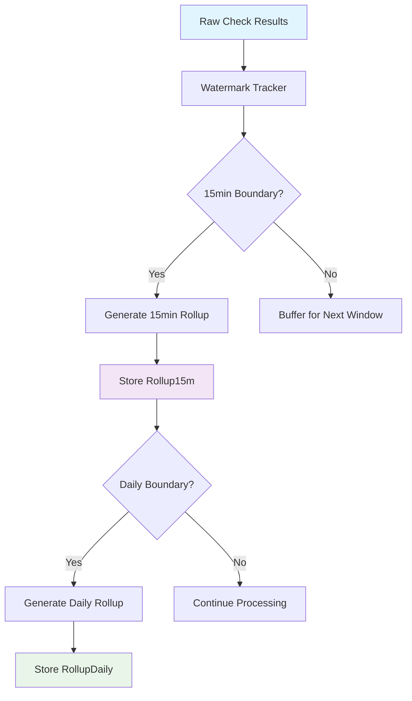
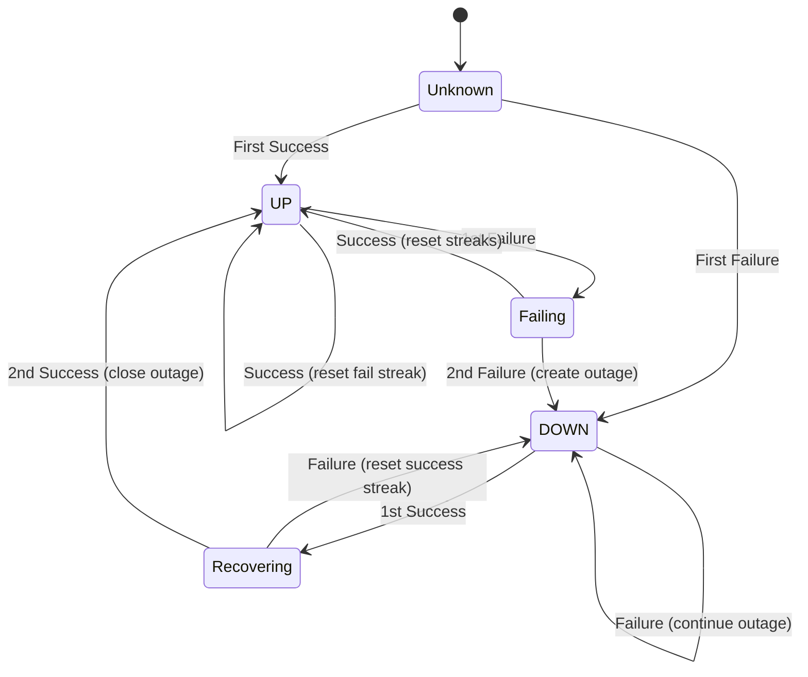

# ThingConnect Pulse - Rollups & Outage Detection Specification

This document defines the complete rollup algorithms, watermark-based processing, outage lifecycle management, and data retention policies for ThingConnect Pulse v1.

## Rollup Processing Overview

ThingConnect Pulse employs a **watermark-based streaming aggregation** system:



## Watermark Management System

### Watermark Keys & Storage

**Storage Location**: `settings` table with structured keys

```sql
-- Watermark tracking in settings table
INSERT INTO setting (k, v) VALUES 
('rollup.15m.watermark.global', '2024-08-25T14:30:00Z'),
('rollup.daily.watermark.global', '2024-08-25'),
('rollup.15m.last_run', '2024-08-25T14:45:23Z'),
('rollup.daily.last_run', '2024-08-25T01:15:45Z');
```

**Watermark Key Structure**:
- `rollup.{period}.watermark.global` - Global processing watermark
- `rollup.{period}.watermark.endpoint.{guid}` - Per-endpoint watermark (if needed)  
- `rollup.{period}.last_run` - Last successful processing run
- `rollup.{period}.backfill.{guid}` - Backfill operation tracking

### Watermark Update Algorithm

```csharp
public sealed class WatermarkManager
{
    public async Task<DateTimeOffset> GetRollup15mWatermarkAsync()
    {
        var value = await _settingsService.GetAsync("rollup.15m.watermark.global");
        return value != null ? DateTimeOffset.Parse(value) : DateTimeOffset.MinValue;
    }
    
    public async Task UpdateRollup15mWatermarkAsync(DateTimeOffset newWatermark)
    {
        await _settingsService.SetAsync("rollup.15m.watermark.global", 
                                       newWatermark.ToString("O"));
        await _settingsService.SetAsync("rollup.15m.last_run", 
                                       DateTimeOffset.UtcNow.ToString("O"));
    }
    
    // Ensures watermark only moves forward (never backwards)
    public async Task SafeUpdateWatermarkAsync(string key, DateTimeOffset candidate)
    {
        var current = await GetWatermarkAsync(key);
        if (candidate > current)
        {
            await SetWatermarkAsync(key, candidate);
        }
    }
}
```

## 15-Minute Rollup Specification

### Time Bucket Alignment

**Bucket Boundaries**: Aligned to UTC hour boundaries
- 00:00, 00:15, 00:30, 00:45
- 01:00, 01:15, 01:30, 01:45
- etc.

**Bucket Assignment Logic**:
```csharp
public static DateTimeOffset GetRollup15mBucket(DateTimeOffset timestamp)
{
    var utc = timestamp.ToUniversalTime();
    var minute = utc.Minute;
    var alignedMinute = (minute / 15) * 15; // Round down to 0, 15, 30, 45
    
    return new DateTimeOffset(utc.Year, utc.Month, utc.Day, 
                             utc.Hour, alignedMinute, 0, TimeSpan.Zero);
}

// Example: 2024-08-25 14:23:45 UTC → 2024-08-25 14:15:00 UTC
```

### Rollup Calculation Algorithm

**Metrics Computed**:
1. **UpPct**: Percentage of successful checks (0-100)
2. **AvgRttMs**: Average response time (excluding nulls)
3. **DownEvents**: Count of UP→DOWN transitions

**PostgreSQL Implementation**:
```sql
WITH raw_with_buckets AS (
  SELECT
    endpoint_id,
    ts,
    status,
    rtt_ms,
    -- Align to 15-minute boundaries
    DATE_TRUNC('hour', ts) + 
    INTERVAL '15 minute' * FLOOR(EXTRACT(minute FROM ts) / 15) AS bucket_ts,
    -- Track state transitions
    LAG(status) OVER (
      PARTITION BY endpoint_id 
      ORDER BY ts
    ) AS prev_status
  FROM check_result_raw
  WHERE ts > :watermark_ts 
    AND ts <= :process_until_ts
),
aggregated AS (
  SELECT
    endpoint_id,
    bucket_ts,
    -- Uptime percentage
    ROUND(100.0 * AVG(CASE WHEN status = 'up' THEN 1.0 ELSE 0.0 END), 2) AS up_pct,
    -- Average RTT (exclude zero/null values)
    ROUND(AVG(NULLIF(rtt_ms, 0)), 2) AS avg_rtt_ms,
    -- Count UP→DOWN transitions
    COUNT(*) FILTER (WHERE prev_status = 'up' AND status = 'down') AS down_events,
    -- Metadata for debugging
    COUNT(*) AS total_checks,
    MIN(ts) AS first_check_ts,
    MAX(ts) AS last_check_ts
  FROM raw_with_buckets
  GROUP BY endpoint_id, bucket_ts
  -- Only process complete buckets (not partial current bucket)
  HAVING bucket_ts < DATE_TRUNC('hour', NOW()) + 
                     INTERVAL '15 minute' * FLOOR(EXTRACT(minute FROM NOW()) / 15)
)
INSERT INTO rollup_15m (endpoint_id, bucket_ts, up_pct, avg_rtt_ms, down_events)
SELECT endpoint_id, bucket_ts, up_pct, avg_rtt_ms, down_events
FROM aggregated
ON CONFLICT (endpoint_id, bucket_ts) DO UPDATE SET
  up_pct = EXCLUDED.up_pct,
  avg_rtt_ms = EXCLUDED.avg_rtt_ms,
  down_events = EXCLUDED.down_events;
```

**SQLite Implementation** (Portable C# LINQ):
```csharp
public async Task<int> ProcessRollup15mAsync(DateTimeOffset watermark)
{
    var processUntil = GetCurrentCompleteBucket15m();
    
    var rawData = await _context.CheckResultsRaw
        .Where(x => x.Ts > watermark && x.Ts <= processUntil)
        .OrderBy(x => x.EndpointId)
        .ThenBy(x => x.Ts)
        .ToListAsync();
    
    var withBuckets = rawData.Select((check, index) => new
    {
        check.EndpointId,
        check.Ts,
        check.Status,
        check.RttMs,
        BucketTs = GetRollup15mBucket(check.Ts),
        PrevStatus = index > 0 && rawData[index - 1].EndpointId == check.EndpointId 
                   ? rawData[index - 1].Status 
                   : (UpDown?)null
    });
    
    var rollups = withBuckets
        .GroupBy(x => new { x.EndpointId, x.BucketTs })
        .Select(g => new Rollup15m
        {
            EndpointId = g.Key.EndpointId,
            BucketTs = g.Key.BucketTs,
            UpPct = Math.Round(100.0 * g.Average(x => x.Status == UpDown.up ? 1.0 : 0.0), 2),
            AvgRttMs = g.Where(x => x.RttMs.HasValue && x.RttMs > 0)
                      .Select(x => x.RttMs.Value)
                      .DefaultIfEmpty()
                      .Average(),
            DownEvents = g.Count(x => x.PrevStatus == UpDown.up && x.Status == UpDown.down)
        })
        .Where(r => r.BucketTs < GetCurrentCompleteBucket15m()) // Only complete buckets
        .ToList();
    
    // Upsert rollups
    foreach (var rollup in rollups)
    {
        var existing = await _context.Rollups15m
            .FirstOrDefaultAsync(x => x.EndpointId == rollup.EndpointId && 
                                    x.BucketTs == rollup.BucketTs);
        
        if (existing != null)
        {
            existing.UpPct = rollup.UpPct;
            existing.AvgRttMs = rollup.AvgRttMs;
            existing.DownEvents = rollup.DownEvents;
        }
        else
        {
            _context.Rollups15m.Add(rollup);
        }
    }
    
    await _context.SaveChangesAsync();
    return rollups.Count;
}
```

## Daily Rollup Specification

### Time Bucket Alignment

**Bucket Boundaries**: UTC calendar days
- 2024-08-25 00:00:00 UTC to 2024-08-26 00:00:00 UTC

**Alternative**: Site-local time zones (future enhancement)
```csharp
// Future: Site-specific timezone support
public static DateOnly GetRollupDailyBucket(DateTimeOffset timestamp, TimeZoneInfo siteTimeZone)
{
    var siteTime = TimeZoneInfo.ConvertTime(timestamp, siteTimeZone);
    return DateOnly.FromDateTime(siteTime.Date);
}
```

### Daily Aggregation Sources

**Two-tier approach for efficiency**:

1. **Primary**: Aggregate from Rollup15m (preferred)
2. **Fallback**: Aggregate from CheckResultRaw (when 15m data missing)

**PostgreSQL Implementation** (from 15m rollups):
```sql
WITH daily_agg AS (
  SELECT
    endpoint_id,
    DATE(bucket_ts) AS bucket_date,
    -- Weighted average of uptime percentages
    ROUND(AVG(up_pct), 2) AS up_pct,
    -- Average of averages (approximation)
    ROUND(AVG(avg_rtt_ms), 2) AS avg_rtt_ms,
    -- Sum of down events across all 15m buckets
    SUM(down_events) AS down_events,
    -- Metadata
    COUNT(*) AS bucket_count, -- Should be 96 for complete day
    MIN(bucket_ts) AS first_bucket_ts,
    MAX(bucket_ts) AS last_bucket_ts
  FROM rollup_15m
  WHERE bucket_ts >= :from_date 
    AND bucket_ts < :to_date + INTERVAL '1 day'
  GROUP BY endpoint_id, DATE(bucket_ts)
  -- Only process complete days (94+ buckets = 97.9% coverage)
  HAVING COUNT(*) >= 94
)
INSERT INTO rollup_daily (endpoint_id, bucket_date, up_pct, avg_rtt_ms, down_events)
SELECT endpoint_id, bucket_date, up_pct, avg_rtt_ms, down_events
FROM daily_agg
ON CONFLICT (endpoint_id, bucket_date) DO UPDATE SET
  up_pct = EXCLUDED.up_pct,
  avg_rtt_ms = EXCLUDED.avg_rtt_ms,
  down_events = EXCLUDED.down_events;
```

**Fallback Implementation** (direct from raw data):
```sql
WITH raw_daily AS (
  SELECT
    endpoint_id,
    DATE(ts) AS bucket_date,
    status,
    rtt_ms,
    LAG(status) OVER (
      PARTITION BY endpoint_id 
      ORDER BY ts
    ) AS prev_status
  FROM check_result_raw
  WHERE DATE(ts) = :target_date
),
daily_agg AS (
  SELECT
    endpoint_id,
    bucket_date,
    ROUND(100.0 * AVG(CASE WHEN status = 'up' THEN 1.0 ELSE 0.0 END), 2) AS up_pct,
    ROUND(AVG(NULLIF(rtt_ms, 0)), 2) AS avg_rtt_ms,
    COUNT(*) FILTER (WHERE prev_status = 'up' AND status = 'down') AS down_events
  FROM raw_daily
  GROUP BY endpoint_id, bucket_date
)
INSERT INTO rollup_daily (endpoint_id, bucket_date, up_pct, avg_rtt_ms, down_events)
SELECT * FROM daily_agg
ON CONFLICT (endpoint_id, bucket_date) DO UPDATE SET
  up_pct = EXCLUDED.up_pct,
  avg_rtt_ms = EXCLUDED.avg_rtt_ms,
  down_events = EXCLUDED.down_events;
```

## Outage Detection & Lifecycle Management

### Flap Damping State Machine

**2/2 Threshold Model**: Prevents spurious state changes



### In-Memory State Management

```csharp
public sealed class MonitorState
{
    public UpDown? LastPublicStatus { get; set; }     // Last reported status
    public int FailStreak { get; set; }               // Consecutive failures
    public int SuccessStreak { get; set; }            // Consecutive successes
    public DateTimeOffset? LastChangeTs { get; set; } // Last state transition
    public long? OpenOutageId { get; set; }           // Active outage ID
    public DateTimeOffset? FirstFailureTs { get; set; } // For outage start time
    public string? LastError { get; set; }            // Most recent error
}
```

### Outage Lifecycle Implementation

```csharp
public sealed class OutageDetectionService : IOutageDetectionService
{
    private readonly Dictionary<Guid, MonitorState> _states = new();
    private readonly ILogger<OutageDetectionService> _logger;
    private readonly PulseDbContext _context;
    
    public async Task ProcessCheckResultAsync(CheckResult result)
    {
        var state = GetOrCreateState(result.EndpointId);
        var previousStatus = state.LastPublicStatus;
        
        if (result.IsSuccess)
        {
            state.SuccessStreak++;
            state.FailStreak = 0;
            state.LastError = null;
            
            // Check for UP transition (2 consecutive successes)
            if (ShouldTransitionToUp(state))
            {
                await TransitionToUpAsync(result.EndpointId, result.Timestamp, state);
            }
        }
        else
        {
            state.FailStreak++;
            state.SuccessStreak = 0;
            state.LastError = result.Error;
            
            // Track first failure timestamp for outage start
            if (state.FailStreak == 1)
            {
                state.FirstFailureTs = result.Timestamp;
            }
            
            // Check for DOWN transition (2 consecutive failures)  
            if (ShouldTransitionToDown(state))
            {
                await TransitionToDownAsync(result.EndpointId, state);
            }
        }
    }
    
    private bool ShouldTransitionToDown(MonitorState state)
    {
        return state.LastPublicStatus != UpDown.down && state.FailStreak >= 2;
    }
    
    private bool ShouldTransitionToUp(MonitorState state)
    {
        return state.LastPublicStatus != UpDown.up && state.SuccessStreak >= 2;
    }
    
    private async Task TransitionToDownAsync(Guid endpointId, MonitorState state)
    {
        _logger.LogWarning("Endpoint {EndpointId} transitioning to DOWN after {FailStreak} failures", 
                          endpointId, state.FailStreak);
        
        // Create outage record
        var outage = new Outage
        {
            EndpointId = endpointId,
            StartTs = state.FirstFailureTs!.Value, // Use first failure time
            StartError = state.LastError
        };
        
        _context.Outages.Add(outage);
        await _context.SaveChangesAsync();
        
        // Update state
        state.LastPublicStatus = UpDown.down;
        state.LastChangeTs = DateTimeOffset.UtcNow;
        state.OpenOutageId = outage.Id;
        
        // Update endpoint status
        await UpdateEndpointStatusAsync(endpointId, UpDown.down, state.LastChangeTs.Value);
    }
    
    private async Task TransitionToUpAsync(Guid endpointId, DateTimeOffset timestamp, MonitorState state)
    {
        _logger.LogInformation("Endpoint {EndpointId} transitioning to UP after {SuccessStreak} successes",
                             endpointId, state.SuccessStreak);
        
        // Close open outage if exists
        if (state.OpenOutageId.HasValue)
        {
            var outage = await _context.Outages
                .FirstOrDefaultAsync(x => x.Id == state.OpenOutageId.Value);
                
            if (outage != null)
            {
                outage.EndTs = timestamp;
                outage.DurationSeconds = (int)(timestamp - outage.StartTs).TotalSeconds;
                outage.EndError = state.LastError; // Last error before recovery
                
                _logger.LogInformation("Closed outage {OutageId} for endpoint {EndpointId}, duration: {Duration}s",
                                     outage.Id, endpointId, outage.DurationSeconds);
            }
        }
        
        // Update state  
        state.LastPublicStatus = UpDown.up;
        state.LastChangeTs = timestamp;
        state.OpenOutageId = null;
        state.FirstFailureTs = null;
        
        await _context.SaveChangesAsync();
        await UpdateEndpointStatusAsync(endpointId, UpDown.up, timestamp);
    }
}
```

## Processing Schedule & Background Service

### Rollup Background Service

```csharp
public sealed class RollupBackgroundService : BackgroundService
{
    private readonly IServiceScopeFactory _scopeFactory;
    private readonly ILogger<RollupBackgroundService> _logger;
    
    protected override async Task ExecuteAsync(CancellationToken stoppingToken)
    {
        while (!stoppingToken.IsCancellationRequested)
        {
            try
            {
                using var scope = _scopeFactory.CreateScope();
                var rollupService = scope.ServiceProvider.GetRequiredService<IRollupService>();
                
                // Process 15-minute rollups every 5 minutes
                await rollupService.ProcessRollup15mAsync();
                
                // Process daily rollups every hour (but only when needed)
                if (DateTime.UtcNow.Minute < 5) // First 5 minutes of each hour
                {
                    await rollupService.ProcessRollupDailyAsync();
                }
                
                // Wait 5 minutes before next cycle
                await Task.Delay(TimeSpan.FromMinutes(5), stoppingToken);
            }
            catch (Exception ex)
            {
                _logger.LogError(ex, "Error in rollup processing cycle");
                await Task.Delay(TimeSpan.FromMinutes(1), stoppingToken); // Shorter retry delay
            }
        }
    }
}
```

### Processing Schedule

**15-Minute Rollups**:
- **Frequency**: Every 5 minutes
- **Latency**: 5-10 minutes behind real-time  
- **Logic**: Only process complete buckets (not current partial bucket)

**Daily Rollups**:
- **Frequency**: Once per hour (00:05, 01:05, 02:05...)
- **Latency**: 1-2 hours behind real-time
- **Logic**: Process previous complete day when sufficient 15m data available

**Processing Windows**:
```csharp
public static class ProcessingWindows
{
    public static DateTimeOffset GetCurrentCompleteBucket15m()
    {
        var now = DateTimeOffset.UtcNow;
        var currentBucket = GetRollup15mBucket(now);
        
        // Return previous complete bucket (not current partial)
        return currentBucket.AddMinutes(-15);
    }
    
    public static DateOnly GetCurrentCompleteDay()
    {
        var now = DateTimeOffset.UtcNow.Date;
        
        // Return previous complete day
        return DateOnly.FromDateTime(now.AddDays(-1));
    }
}
```

## Recompute & Backfill Policy

### Recompute Scenarios

**When rollups need recomputation**:
1. **New endpoints added**: Backfill historical rollups
2. **Data correction**: Fix incorrect raw check results
3. **Algorithm updates**: Apply improved rollup calculations
4. **Outage adjustments**: Manual outage start/end time corrections

### Backfill Strategy

**Incremental backfill** to avoid overwhelming the system:

```csharp
public async Task BackfillRollup15mAsync(Guid endpointId, DateTimeOffset fromDate, DateTimeOffset toDate)
{
    var batchSize = TimeSpan.FromDays(7); // Process 1 week at a time
    var current = fromDate;
    
    while (current < toDate)
    {
        var batchEnd = current.Add(batchSize);
        if (batchEnd > toDate) batchEnd = toDate;
        
        _logger.LogInformation("Backfilling rollup_15m for endpoint {EndpointId} from {From} to {To}",
                             endpointId, current, batchEnd);
        
        // Process batch with dedicated watermark
        await ProcessRollup15mBatchAsync(endpointId, current, batchEnd);
        
        // Update backfill progress
        await _settingsService.SetAsync($"rollup.15m.backfill.{endpointId}", current.ToString("O"));
        
        current = batchEnd;
        
        // Throttle to prevent system overload
        await Task.Delay(TimeSpan.FromSeconds(5));
    }
    
    // Clear backfill tracking
    await _settingsService.RemoveAsync($"rollup.15m.backfill.{endpointId}");
}
```

### Recompute Validation

**Verification queries** to ensure rollup accuracy:

```sql
-- Validate 15m rollup against raw data
WITH raw_check AS (
  SELECT
    endpoint_id,
    DATE_TRUNC('hour', ts) + INTERVAL '15 minute' * FLOOR(EXTRACT(minute FROM ts) / 15) AS bucket_ts,
    100.0 * AVG(CASE WHEN status = 'up' THEN 1.0 ELSE 0.0 END) AS calculated_up_pct,
    COUNT(*) AS raw_count
  FROM check_result_raw
  WHERE endpoint_id = :endpoint_id
    AND ts >= :bucket_start 
    AND ts < :bucket_end
  GROUP BY endpoint_id, bucket_ts
),
rollup_check AS (
  SELECT endpoint_id, bucket_ts, up_pct, down_events
  FROM rollup_15m
  WHERE endpoint_id = :endpoint_id
    AND bucket_ts >= :bucket_start
    AND bucket_ts < :bucket_end
)
SELECT 
  r.bucket_ts,
  r.up_pct AS rollup_up_pct,
  c.calculated_up_pct,
  ABS(r.up_pct - c.calculated_up_pct) AS difference,
  c.raw_count
FROM rollup_check r
JOIN raw_check c ON r.endpoint_id = c.endpoint_id AND r.bucket_ts = c.bucket_ts
WHERE ABS(r.up_pct - c.calculated_up_pct) > 0.1; -- Flag discrepancies > 0.1%
```

## Test Vectors & Examples

### 15-Minute Rollup Test Case

**Input Data** (CheckResultRaw):
```json
[
  {"ts": "2024-08-25T14:00:00Z", "status": "up", "rtt_ms": 45.2},
  {"ts": "2024-08-25T14:05:00Z", "status": "up", "rtt_ms": 52.1}, 
  {"ts": "2024-08-25T14:10:00Z", "status": "down", "rtt_ms": null},
  {"ts": "2024-08-25T14:15:00Z", "status": "down", "rtt_ms": null},
  {"ts": "2024-08-25T14:20:00Z", "status": "up", "rtt_ms": 38.7},
  {"ts": "2024-08-25T14:25:00Z", "status": "up", "rtt_ms": 41.3}
]
```

**Expected Output** (Rollup15m):
```json
[
  {
    "endpoint_id": "f47ac10b-58cc-4372-a567-0e02b2c3d479",
    "bucket_ts": "2024-08-25T14:00:00Z",
    "up_pct": 66.67,
    "avg_rtt_ms": 48.65,
    "down_events": 1
  },
  {
    "endpoint_id": "f47ac10b-58cc-4372-a567-0e02b2c3d479", 
    "bucket_ts": "2024-08-25T14:15:00Z",
    "up_pct": 66.67,
    "avg_rtt_ms": 40.0,
    "down_events": 0
  }
]
```

**Calculation Breakdown**:

*Bucket 14:00-14:15 (3 checks)*:
- UpPct: (2 up + 1 down) = 2/3 = 66.67%
- AvgRttMs: (45.2 + 52.1) / 2 = 48.65ms (nulls excluded)
- DownEvents: UP→DOWN at 14:10 = 1 transition

*Bucket 14:15-14:30 (3 checks)*:
- UpPct: (1 down + 2 up) = 2/3 = 66.67%
- AvgRttMs: (38.7 + 41.3) / 2 = 40.0ms
- DownEvents: 0 (no UP→DOWN transitions)

### Outage Detection Test Case

**Input Sequence**:
```json
[
  {"ts": "2024-08-25T14:00:00Z", "status": "up"},     // Initial UP
  {"ts": "2024-08-25T14:01:00Z", "status": "down"},   // 1st failure
  {"ts": "2024-08-25T14:02:00Z", "status": "down"},   // 2nd failure → CREATE OUTAGE
  {"ts": "2024-08-25T14:03:00Z", "status": "down"},   // Continue outage
  {"ts": "2024-08-25T14:04:00Z", "status": "up"},     // 1st recovery
  {"ts": "2024-08-25T14:05:00Z", "status": "up"}      // 2nd recovery → CLOSE OUTAGE
]
```

**Expected State Transitions**:

| Timestamp | Check | FailStreak | SuccessStreak | PublicStatus | Action |
|-----------|-------|------------|---------------|-------------|---------|
| 14:00:00 | UP | 0 | 1 | UP | Initial state |
| 14:01:00 | DOWN | 1 | 0 | UP | First failure, no transition |
| 14:02:00 | DOWN | 2 | 0 | DOWN | **Create Outage #123** |
| 14:03:00 | DOWN | 3 | 0 | DOWN | Continue outage |
| 14:04:00 | UP | 0 | 1 | DOWN | First recovery, no transition |
| 14:05:00 | UP | 0 | 2 | UP | **Close Outage #123** |

**Expected Outage Record**:
```json
{
  "id": 123,
  "endpoint_id": "f47ac10b-58cc-4372-a567-0e02b2c3d479",
  "start_ts": "2024-08-25T14:01:00Z",
  "end_ts": "2024-08-25T14:05:00Z", 
  "duration_seconds": 240,
  "start_error": "Connection timeout after 1500ms",
  "end_error": "Connection timeout after 1500ms"
}
```

### Daily Rollup Test Case

**Input Data** (Rollup15m for 2024-08-25):
```json
[
  {"bucket_ts": "2024-08-25T00:00:00Z", "up_pct": 100.0, "avg_rtt_ms": 45.0, "down_events": 0},
  {"bucket_ts": "2024-08-25T00:15:00Z", "up_pct": 95.0, "avg_rtt_ms": 47.0, "down_events": 1},
  // ... 94 more 15-minute buckets ...
  {"bucket_ts": "2024-08-25T23:45:00Z", "up_pct": 98.0, "avg_rtt_ms": 43.0, "down_events": 0}
]
```

**Expected Output** (RollupDaily):
```json
{
  "endpoint_id": "f47ac10b-58cc-4372-a567-0e02b2c3d479",
  "bucket_date": "2024-08-25",
  "up_pct": 97.85,
  "avg_rtt_ms": 45.12,
  "down_events": 23
}
```

## Data Retention & Cleanup

### Retention Policies

**Default Retention Periods**:
- **CheckResultRaw**: 60 days (configurable via `data.retention.raw_days`)
- **Outage**: Permanent retention
- **Rollup15m**: 1 year (configurable via `data.retention.rollup15m_days`)
- **RollupDaily**: Permanent retention

### Cleanup Implementation

```csharp
public sealed class DataCleanupService : BackgroundService
{
    protected override async Task ExecuteAsync(CancellationToken stoppingToken)
    {
        while (!stoppingToken.IsCancellationRequested)
        {
            try
            {
                await CleanupExpiredRawDataAsync();
                await CleanupExpiredRollup15mAsync();
                
                // Run cleanup daily at 02:00 UTC
                var nextRun = DateTime.Today.AddDays(1).AddHours(2);
                var delay = nextRun - DateTime.UtcNow;
                
                await Task.Delay(delay, stoppingToken);
            }
            catch (Exception ex)
            {
                _logger.LogError(ex, "Error in data cleanup cycle");
                await Task.Delay(TimeSpan.FromHours(1), stoppingToken);
            }
        }
    }
    
    private async Task CleanupExpiredRawDataAsync()
    {
        var retentionDays = _configuration.GetValue<int>("Data:Retention:RawDays", 60);
        var cutoffDate = DateTimeOffset.UtcNow.AddDays(-retentionDays);
        
        var deletedCount = await _context.Database.ExecuteSqlAsync("""
            DELETE FROM check_result_raw 
            WHERE ts < {0}
            """, cutoffDate);
        
        _logger.LogInformation("Deleted {Count} expired raw check results older than {CutoffDate}",
                             deletedCount, cutoffDate.ToString("yyyy-MM-dd"));
    }
}
```

## Performance Optimization

### Index Strategy for Rollups

**Critical indexes for rollup queries**:

```sql
-- 15-minute rollup generation (most frequent)
CREATE INDEX ix_check_result_raw_endpoint_ts_status 
ON check_result_raw(endpoint_id, ts, status);

-- Daily rollup from 15m data
CREATE INDEX ix_rollup_15m_endpoint_bucket 
ON rollup_15m(endpoint_id, bucket_ts);

-- Time-based cleanup
CREATE INDEX ix_check_result_raw_ts_only 
ON check_result_raw(ts);

CREATE INDEX ix_rollup_15m_ts_only 
ON rollup_15m(bucket_ts);
```

### Batch Processing Limits

**Processing thresholds** to prevent resource exhaustion:

```csharp
public static class ProcessingLimits
{
    public const int MaxEndpointsPerBatch = 1000;
    public const int MaxRawRecordsPerBatch = 100000;  
    public const TimeSpan MaxProcessingTimePerBatch = TimeSpan.FromMinutes(10);
    public const int MaxRollupBucketsPerBatch = 10000;
}
```

### Memory Management

**Streaming processing** for large datasets:

```csharp
public async IAsyncEnumerable<Rollup15m> ProcessRollup15mStreamingAsync(
    DateTimeOffset fromTs, DateTimeOffset toTs)
{
    const int batchSize = 10000;
    var offset = 0;
    
    while (true)
    {
        var batch = await _context.CheckResultsRaw
            .Where(x => x.Ts > fromTs && x.Ts <= toTs)
            .OrderBy(x => x.EndpointId)
            .ThenBy(x => x.Ts)
            .Skip(offset)
            .Take(batchSize)
            .ToListAsync();
        
        if (!batch.Any()) break;
        
        var rollups = ProcessBatchToRollups(batch);
        
        foreach (var rollup in rollups)
        {
            yield return rollup;
        }
        
        offset += batchSize;
    }
}
```

## Unit Test Matrix

### Test Coverage Requirements

**Rollup Algorithm Tests**:
- [x] 15-minute bucket alignment accuracy
- [x] Uptime percentage calculation with various failure patterns  
- [x] RTT averaging with null/zero value handling
- [x] Down event counting across bucket boundaries
- [x] Edge cases: single check, all failures, all successes
- [x] Time zone handling (UTC alignment)

**Outage Detection Tests**:
- [x] 2/2 flap damping state transitions
- [x] Outage creation on 2nd consecutive failure
- [x] Outage closure on 2nd consecutive success  
- [x] Edge cases: rapid flapping, service restart scenarios
- [x] State persistence across application restarts
- [x] Concurrent endpoint processing

**Watermark Management Tests**:
- [x] Watermark advancement (forward-only)
- [x] Recovery from processing failures
- [x] Duplicate processing prevention
- [x] Backfill operation tracking

**Data Quality Tests**:
- [x] Rollup accuracy verification against raw data
- [x] Daily rollup consistency with 15m aggregation
- [x] Missing data handling (incomplete buckets)
- [x] Performance regression testing

### Sample Unit Tests

```csharp
[Test]
public void GetRollup15mBucket_AlignsToBoundaries()
{
    // Test various timestamps align to correct 15-minute boundaries
    var testCases = new[]
    {
        (Input: "2024-08-25T14:00:00Z", Expected: "2024-08-25T14:00:00Z"),
        (Input: "2024-08-25T14:07:30Z", Expected: "2024-08-25T14:00:00Z"), 
        (Input: "2024-08-25T14:15:00Z", Expected: "2024-08-25T14:15:00Z"),
        (Input: "2024-08-25T14:23:45Z", Expected: "2024-08-25T14:15:00Z"),
        (Input: "2024-08-25T14:59:59Z", Expected: "2024-08-25T14:45:00Z")
    };
    
    foreach (var (input, expected) in testCases)
    {
        var inputTs = DateTimeOffset.Parse(input);
        var expectedTs = DateTimeOffset.Parse(expected);
        var actual = RollupProcessor.GetRollup15mBucket(inputTs);
        
        Assert.That(actual, Is.EqualTo(expectedTs), 
                   $"Input {input} should align to {expected}");
    }
}

[Test]  
public async Task OutageDetection_CreatesOutageAfter2Failures()
{
    // Arrange
    var endpointId = Guid.NewGuid();
    var service = CreateOutageDetectionService();
    
    // Act & Assert
    await service.ProcessCheckResultAsync(CreateCheckResult(endpointId, true));  // UP
    Assert.That(GetPublicStatus(endpointId), Is.EqualTo(UpDown.up));
    
    await service.ProcessCheckResultAsync(CreateCheckResult(endpointId, false)); // 1st FAIL
    Assert.That(GetPublicStatus(endpointId), Is.EqualTo(UpDown.up)); // No change yet
    
    await service.ProcessCheckResultAsync(CreateCheckResult(endpointId, false)); // 2nd FAIL
    Assert.That(GetPublicStatus(endpointId), Is.EqualTo(UpDown.down)); // Now DOWN
    
    // Verify outage created
    var outage = await _context.Outages
        .FirstOrDefaultAsync(x => x.EndpointId == endpointId && x.EndTs == null);
    Assert.That(outage, Is.Not.Null);
}
```

---

**Document Version**: 1.0  
**Last Updated**: 2025-08-25  
**Next Review**: 2025-11-25  
**Owner**: ThingConnect Development Team