# RTT Value Tracing and Investigation

## RTT Journey Flow Diagram

```mermaid
graph TD
    A[Probe Service] -->|Measure RTT| B[CheckResult]
    B -->|RttMs| C[MonitoringBackgroundService]
    C -->|Update Endpoint| D[OutageDetectionService]
    D -->|Persist LastRttMs| E[StatusService]
    E -->|Serialize RTT| F[API Controller]
    F -->|Response| G[Frontend Service]
    G -->|Render| H[Frontend Components]

    subgraph Potential Failure Points
        A -->|Null/Zero RTT| B
        B -->|Null RttMs| C
        C -->|Ignore Null RTT| D
        D -->|Skip Update| E
        E -->|Empty RTT| F
        F -->|Omit RTT| G
        G -->|Display Placeholder| H
    end
```



## RTT Tracing Points

### 1. Probe Service (`ProbeService.cs`)
- **Probe Types**:
  - ICMP: Uses `reply.RoundtripTime`
  - TCP: Uses `stopwatch.ElapsedMilliseconds`
  - HTTP: Uses `stopwatch.ElapsedMilliseconds`
- **Failure Handling**:
  - Sets `RttMs` to null on probe failures
  - Different measurement methods may introduce inconsistencies

### 2. Background Monitoring Service
- Logs RTT with trace:
  ```csharp
  _logger.LogTrace("Probed endpoint {EndpointId} ({Name}): {Status} in {RttMs}ms")
  ```
- Converts null RTT to "N/A"

### 3. Outage Detection Service
- Copies `result.RttMs` to new records
- Potential loss point if RTT is null

### 4. Status Service
- Uses `endpoint.LastRttMs` to populate status responses
- May return null/empty RTT

### 5. Frontend Service and Components
- Uses optional chaining and nullish coalescing
- Handles null RTT with placeholders ('-')

## Investigation Steps

### 1. Probe Measurement Verification
- [ ] Compare RTT measurements across different probe types
- [ ] Add detailed logging in `ProbeService`
- [ ] Verify stopwatch and `RoundtripTime` calculations

### 2. Null Value Propagation Analysis
- [ ] Trace null RTT through each service layer
- [ ] Add comprehensive logging
- [ ] Validate null handling in serialization

### 3. API Contract Validation
- [ ] Inspect API response DTOs
- [ ] Check JSON serialization of RTT values
- [ ] Verify optional/nullable field handling

### 4. Frontend Parsing Investigation
- [ ] Review TypeScript type definitions
- [ ] Validate RTT parsing in API services
- [ ] Test display logic for various RTT scenarios

### 5. Comprehensive Test Scenarios
- [ ] Successful probe with non-zero RTT
- [ ] Failed probe (null RTT)
- [ ] Edge cases: zero, very low, very high RTT values
- [ ] Multiple probe type comparisons

## Potential Improvement Recommendations
- Standardize RTT measurement across probe types
- Implement consistent null/zero RTT handling
- Add more granular logging and tracing
- Create comprehensive test suite for RTT propagation