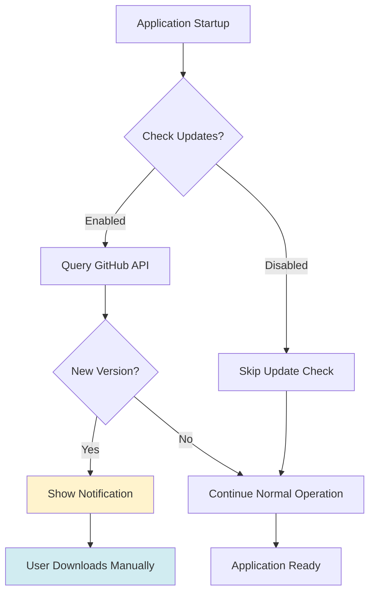

# ThingConnect Pulse - Update Management

This document defines the update strategy, version checking, and deployment procedures for ThingConnect Pulse.

## Update Strategy Overview

ThingConnect Pulse uses a **manual update model** with optional update notifications:



## Version Management

### Versioning Scheme

**Semantic Versioning (SemVer 2.0)**:
- **MAJOR.MINOR.PATCH** format (e.g., `1.2.3`)
- **Pre-release identifiers**: `1.0.0-beta.1`, `1.0.0-rc.2`
- **Build metadata**: `1.0.0+build.123`

**Version Progression**:
```
0.1.0 → 0.2.0 → 0.9.0 → 1.0.0 → 1.0.1 → 1.1.0 → 2.0.0
```

**Version Categories**:
- **Major (X.0.0)**: Breaking changes, database migrations required
- **Minor (1.X.0)**: New features, backward compatible
- **Patch (1.0.X)**: Bug fixes, security updates

### Release Channels

**Stable Channel** (Default):
- **Target**: Production deployments
- **Frequency**: Monthly or as-needed for critical fixes
- **Quality**: Full testing, documentation complete
- **Support**: Full support and maintenance

**Beta Channel** (Opt-in):
- **Target**: Testing environments, early adopters
- **Frequency**: Bi-weekly or feature-driven
- **Quality**: Feature complete, limited testing
- **Support**: Community support, known issues documented

**Development Channel** (Internal):
- **Target**: Development team only
- **Frequency**: Continuous integration builds
- **Quality**: Experimental, may be unstable
- **Support**: No support provided

## Update Detection & Notification

### Manual Update Check JSON Contract

ThingConnect Pulse uses a **static JSON contract** for manual update checks, designed to be offline-safe and simple to implement.

**Update Check JSON Schema**:
```json
{
  "$schema": "http://json-schema.org/draft-07/schema#",
  "title": "ThingConnect Pulse Update Check",
  "type": "object",
  "required": ["current", "latest", "notes_url"],
  "properties": {
    "current": {
      "type": "string",
      "pattern": "^\\d+\\.\\d+\\.\\d+(-.+)?$",
      "description": "Current application version in SemVer format"
    },
    "latest": {
      "type": "string", 
      "pattern": "^\\d+\\.\\d+\\.\\d+(-.+)?$",
      "description": "Latest available version in SemVer format"
    },
    "notes_url": {
      "type": "string",
      "format": "uri",
      "description": "URL to release notes for the latest version"
    }
  }
}
```

**Example Update Check Response**:
```json
{
  "current": "1.0.0",
  "latest": "1.2.1", 
  "notes_url": "https://github.com/MachDatum/ThingConnect.Pulse/releases/tag/v1.2.1"
}
```

### Update Check Implementation

**Manual Update Check Service**:
```csharp
public sealed class UpdateService : IUpdateService
{
    private readonly HttpClient _httpClient;
    private readonly ILogger<UpdateService> _logger;
    
    public async Task<UpdateInfo> CheckForUpdatesAsync(string updateJsonUrl)
    {
        try
        {
            _httpClient.DefaultRequestHeaders.Add("User-Agent", "ThingConnect.Pulse/1.0.0");
            
            var response = await _httpClient.GetStringAsync(updateJsonUrl);
            var updateCheck = JsonSerializer.Deserialize<UpdateCheckResponse>(response);
            
            var latestVersion = Version.Parse(updateCheck.Latest);
            var currentVersion = Version.Parse(updateCheck.Current);
            
            return new UpdateInfo
            {
                HasUpdate = latestVersion > currentVersion,
                LatestVersion = latestVersion,
                CurrentVersion = currentVersion,
                NotesUrl = updateCheck.NotesUrl,
                UpdateAvailable = latestVersion > currentVersion
            };
        }
        catch (Exception ex)
        {
            _logger.LogWarning(ex, "Failed to check for updates from {Url}", updateJsonUrl);
            return UpdateInfo.CheckFailed();
        }
    }
}

public record UpdateCheckResponse(
    string Current,
    string Latest, 
    string NotesUrl
);
```

### Static JSON Hosting

**GitHub Pages Hosting** (Recommended):
- Host `updates.json` in the repository's `gh-pages` branch
- Accessible via: `https://machDatum.github.io/ThingConnect.Pulse/updates.json`
- Automatically updated via GitHub Actions on new releases

**Alternative Hosting Options**:
- **CDN**: CloudFlare, AWS CloudFront, or Azure CDN for global distribution
- **Static hosting**: Netlify, Vercel, or similar services
- **Enterprise**: Internal web servers for air-gapped environments

### Update Check Configuration

**Settings Options**:
```json
{
  "Updates": {
    "CheckEnabled": true,
    "CheckIntervalHours": 24,
    "ReleaseChannel": "stable",
    "AutoDownload": false,
    "NotificationLevel": "major_minor"
  }
}
```

**Configuration Levels**:
- `CheckEnabled`: Enable/disable update checking
- `CheckIntervalHours`: How often to check (1-168 hours)
- `ReleaseChannel`: `stable` or `beta`
- `AutoDownload`: Download updates automatically (future)
- `NotificationLevel`: `all`, `major_minor`, `major_only`, `none`

### Update Notification UI

**In-Application Notifications**:
```csharp
public sealed class UpdateNotification
{
    public string Title => "Update Available";
    public string Message => $"ThingConnect Pulse {LatestVersion} is now available.";
    public string ActionText => "Download Update";
    public NotificationLevel Level { get; set; } // Info, Warning, Critical
    public string DownloadUrl { get; set; }
    public string ReleaseNotes { get; set; }
    public bool CanDismiss { get; set; } = true;
    public bool ShowOnStartup { get; set; } = true;
}
```

**Notification Timing**:
- **Application startup**: Show if update available
- **Background check**: Update status in UI when found
- **Settings page**: Always show current status
- **About dialog**: Include update check functionality

## Update Installation Process

### Current Model (v1.0)

**Manual Installation Steps**:
1. **Download**: User downloads installer from GitHub releases
2. **Stop Service**: `sc stop ThingConnectPulse`
3. **Backup**: Copy `%ProgramData%\ThingConnect.Pulse\` (optional)
4. **Install**: Run new installer (`ThingConnect.Pulse.Setup.exe`)
5. **Migrate**: Database migrations applied automatically
6. **Start Service**: `sc start ThingConnectPulse`
7. **Verify**: Confirm new version and functionality

**Installer Capabilities**:
- **In-place upgrade**: Preserves configuration and data
- **Database migration**: Automatic schema updates  
- **Service restart**: Handles Windows service lifecycle
- **Rollback support**: Uninstaller removes new version

### Future Enhancement (v1.1+)

**Automated Update Options**:
- **Download notifications**: Prompt to download when available
- **One-click update**: Download and install with confirmation
- **Scheduled updates**: Install during maintenance windows
- **Rollback capability**: Quick revert to previous version

## Database Migration & Compatibility

### Migration Strategy

**Forward Compatibility**:
- New versions can always read older database formats
- Migration happens automatically on first startup
- Migration progress logged and reported to user

**Migration Safety**:
- **Backup**: Automatic database backup before migration
- **Validation**: Schema validation before and after
- **Rollback**: Restore backup if migration fails
- **Recovery**: Manual recovery procedures documented

**Example Migration Flow**:
```csharp
public async Task<bool> MigrateToVersionAsync(Version targetVersion)
{
    var currentSchema = await GetDatabaseVersionAsync();
    
    if (currentSchema >= targetVersion)
        return true; // Already up to date
    
    // Create backup
    var backupPath = await CreateDatabaseBackupAsync();
    
    try
    {
        await ApplyMigrationsAsync(currentSchema, targetVersion);
        await SetDatabaseVersionAsync(targetVersion);
        return true;
    }
    catch (Exception ex)
    {
        _logger.LogError(ex, "Migration failed, restoring backup");
        await RestoreDatabaseBackupAsync(backupPath);
        throw;
    }
}
```

### Breaking Changes Management

**Major Version Procedures**:
- **Data export**: Tools to export data before upgrade
- **Configuration conversion**: Automatic config migration
- **API changes**: Documented breaking changes
- **Support timeline**: Old version support period defined

**Communication Strategy**:
- **Release notes**: Detailed breaking changes documentation
- **Migration guide**: Step-by-step upgrade procedures
- **Advance notice**: Breaking changes announced in minor releases
- **Support window**: Previous major version supported for 6 months

## Security Updates

### Critical Update Process

**Security Update Classification**:
- **Critical**: Remote code execution, privilege escalation
- **High**: Data exposure, authentication bypass
- **Medium**: Information disclosure, denial of service
- **Low**: Minor security improvements

**Emergency Update Procedures**:
1. **Assessment**: Evaluate security impact and exploit likelihood
2. **Development**: Create minimal patch focusing on security fix
3. **Testing**: Accelerated testing focused on security scenarios
4. **Release**: Emergency release with clear security advisory
5. **Notification**: Direct communication to all users via multiple channels

**Security Advisory Format**:
```markdown
# Security Advisory: CVE-2024-12345

**Severity**: Critical
**Affected Versions**: 1.0.0 - 1.2.3
**Fixed Version**: 1.2.4

## Summary
Brief description of vulnerability and impact.

## Details
Technical details of the security issue.

## Workarounds
Temporary mitigations if available.

## Resolution
Upgrade to version 1.2.4 or later.
```

## Update Testing & Quality Assurance

### Testing Matrix

**Pre-Release Testing**:
- **Clean install**: Fresh installation on clean systems
- **Upgrade paths**: Test all supported upgrade scenarios
- **Configuration migration**: Verify settings preservation
- **Data integrity**: Confirm monitoring data preservation
- **Service lifecycle**: Windows service start/stop/restart
- **Performance**: Ensure no regression in monitoring performance

**Compatibility Testing**:
- **Windows versions**: Windows 10, 11, Server 2019, 2022
- **Database migrations**: All supported schema versions
- **Configuration formats**: Legacy YAML compatibility
- **API compatibility**: Backward compatibility verification

### Automated Testing

**CI/CD Integration**:
```yaml
# GitHub Actions example
test-upgrade:
  runs-on: windows-latest
  strategy:
    matrix:
      from-version: ['1.0.0', '1.1.0', '1.2.0']
  steps:
    - name: Install old version
      run: |
        Install-Version ${{ matrix.from-version }}
        Start-Service ThingConnectPulse
        
    - name: Create test data
      run: |
        Import-TestConfiguration
        Wait-ForMonitoringData
        
    - name: Upgrade to new version
      run: |
        Stop-Service ThingConnectPulse
        Install-NewVersion
        Start-Service ThingConnectPulse
        
    - name: Verify upgrade
      run: |
        Test-DatabaseIntegrity
        Test-MonitoringFunctionality
        Test-ConfigurationPreservation
```

## Update Rollback & Recovery

### Rollback Procedures

**Automated Rollback** (Future):
- **Health check failures**: Automatic rollback if service fails to start
- **Configuration corruption**: Restore from backup if config invalid
- **Database errors**: Restore database backup if migration fails

**Manual Rollback**:
1. **Stop service**: `sc stop ThingConnectPulse`
2. **Uninstall new version**: Control Panel or `uninstall.exe`
3. **Install previous version**: From archived installer
4. **Restore data**: Copy backed up data directory
5. **Start service**: `sc start ThingConnectPulse`

**Recovery Tools**:
```powershell
# PowerShell recovery script
function Restore-PulseBackup {
    param(
        [Parameter(Mandatory)]
        [string]$BackupPath,
        
        [string]$DataPath = "$env:ProgramData\ThingConnect.Pulse"
    )
    
    Stop-Service -Name "ThingConnectPulse" -Force
    Remove-Item -Path $DataPath -Recurse -Force
    Copy-Item -Path $BackupPath -Destination $DataPath -Recurse
    Start-Service -Name "ThingConnectPulse"
}
```

### Disaster Recovery

**Backup Strategy**:
- **Pre-update backups**: Automatic before any update
- **Scheduled backups**: Daily backups of configuration and data
- **Manual backups**: User-initiated backup functionality
- **Backup retention**: Keep last 7 days + monthly archives

**Recovery Documentation**:
- Step-by-step recovery procedures for common failure scenarios
- Database repair and consistency check procedures
- Configuration recovery from various backup sources
- Emergency contacts and escalation procedures

## Communication & Documentation

### Release Communications

**Release Announcements**:
- **GitHub releases**: Detailed release notes with all changes
- **Documentation updates**: Updated guides and specifications
- **Breaking changes**: Highlighted compatibility impacts
- **Security fixes**: Clear security advisory information

**Communication Channels**:
- **GitHub Discussions**: Community questions and feedback
- **Documentation site**: Updated installation and upgrade guides  
- **Support contacts**: Direct support for upgrade issues

### Update Documentation

**User Guides**:
- **Upgrade procedures**: Step-by-step instructions for each scenario
- **Troubleshooting**: Common update problems and solutions
- **Configuration changes**: New settings and options
- **Feature changes**: New functionality and usage examples

**Administrator Guides**:
- **Deployment planning**: Planning enterprise updates
- **Testing procedures**: Validation steps for production updates
- **Rollback procedures**: Recovery from failed updates
- **Change management**: Integration with organizational change processes

## Future Update Enhancements

### v1.1 Planned Features

**Enhanced Update Experience**:
- **Update notifications**: In-app notifications for available updates
- **Release notes display**: Show release notes within application
- **Download integration**: Direct download links in UI
- **Update scheduling**: Plan updates for maintenance windows

### v2.0 Vision

**Automated Update System**:
- **Automatic downloads**: Background download of approved updates
- **Staged deployment**: Gradual rollout to reduce risk
- **Update management console**: Centralized update control for multiple sites
- **Integration APIs**: Integrate with enterprise patch management systems

---

**Document Version**: 1.0  
**Last Updated**: 2025-08-25  
**Next Review**: 2025-11-25  
**Owner**: ThingConnect Development Team