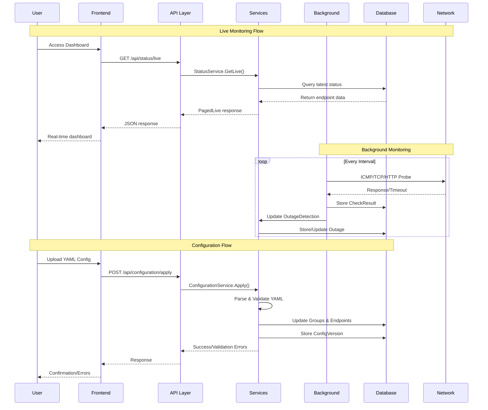
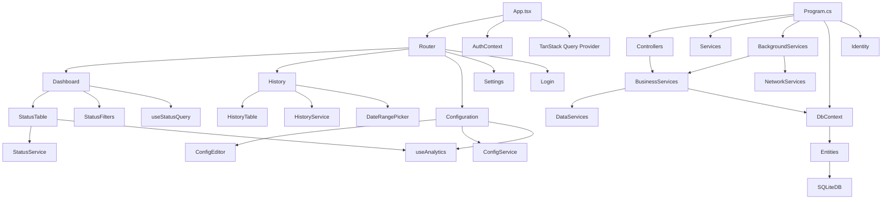

# ThingConnect.Pulse - Complete Architecture Diagram

## Project Architecture Overview

```mermaid
graph TB
    %% Frontend Layer
    subgraph "Frontend (React + Chakra UI)"
        subgraph "Pages"
            Dashboard[Dashboard.tsx]
            History[History.tsx]
            Configuration[Configuration.tsx]
            Settings[Settings.tsx]
            Login[LoginPage.tsx]
            Onboarding[OnboardingPage.tsx]
            EndpointDetail[EndpointDetail.tsx]
        end
        
        subgraph "Components"
            StatusTable[StatusTable.tsx]
            StatusFilters[StatusFilters.tsx]
            AvailabilityChart[AvailabilityChart.tsx]
            ConfigEditor[ConfigurationEditor.tsx]
            HistoryTable[HistoryTable.tsx]
            Navigation[Navigation.tsx]
        end
        
        subgraph "API Services"
            StatusService[StatusService.ts]
            HistoryService[HistoryService.ts]
            ConfigService[ConfigurationService.ts]
            AuthService[AuthService.ts]
            ApiClient[ApiClient.ts]
        end
        
        subgraph "Hooks & Utils"
            useStatusQuery[useStatusQuery.ts]
            useAnalytics[useAnalytics.ts]
            AuthContext[AuthContext.tsx]
            Analytics[manufacturingAnalytics.ts]
        end
    end
    
    %% API Layer
    subgraph "API Endpoints (REST)"
        Auth["/api/auth/*"]
        Status["/api/status/*"]
        Config["/api/configuration/*"]
        HistoryAPI["/api/history/*"]
        UserMgmt["/api/usermanagement/*"]
    end
    
    %% Backend Layer
    subgraph "Backend (ASP.NET Core)"
        subgraph "Controllers"
            AuthController[AuthController.cs]
            StatusController[StatusController.cs]
            ConfigController[ConfigurationController.cs]
            HistoryController[HistoryController.cs]
            UserController[UserManagementController.cs]
        end
        
        subgraph "Business Services"
            ConfigServiceBE[ConfigurationService.cs]
            StatusServiceBE[StatusService.cs]
            HistoryServiceBE[HistoryService.cs]
            ProbeService[ProbeService.cs]
            OutageDetection[OutageDetectionService.cs]
            Discovery[DiscoveryService.cs]
        end
        
        subgraph "Background Services"
            MonitoringBG[MonitoringBackgroundService.cs]
            RollupBG[RollupBackgroundService.cs]
            LogCleanup[LogCleanupBackgroundService.cs]
        end
        
        subgraph "Data Services"
            RollupService[RollupService.cs]
            PruneService[PruneService.cs]
            SettingsService[SettingsService.cs]
            PathService[PathService.cs]
        end
        
        subgraph "Infrastructure"
            SentryService[ConsentAwareSentryService.cs]
            ConfigParser[ConfigurationParser.cs]
            PlainTextFormatter[PlainTextInputFormatter.cs]
        end
    end
    
    %% Data Layer
    subgraph "Data Layer (SQLite + EF Core)"
        subgraph "Entities"
            Group[Group.cs]
            Endpoint[Endpoint.cs]
            CheckResult[CheckResultRaw.cs]
            Outage[Outage.cs]
            Rollup15m[Rollup15m.cs]
            RollupDaily[RollupDaily.cs]
            Setting[Setting.cs]
            ConfigVersion[ConfigVersion.cs]
            AppUser[ApplicationUser.cs]
        end
        
        DbContext[PulseDbContext.cs]
        SQLiteDB[(SQLite Database)]
    end
    
    %% External Services
    subgraph "External"
        Sentry[Sentry.io<br/>Error Monitoring]
        Mixpanel[Mixpanel<br/>Analytics]
        Network[Network Endpoints<br/>ICMP/TCP/HTTP]
    end
    
    %% Frontend to API Connections
    Dashboard -->|GET /api/status/live| Status
    History -->|GET /api/history/endpoint/{id}| HistoryAPI
    Configuration -->|GET,POST /api/configuration/*| Config
    Settings -->|CRUD /api/usermanagement/*| UserMgmt
    Login -->|POST /api/auth/login| Auth
    Onboarding -->|POST /api/auth/register| Auth
    
    %% Service Layer Connections
    StatusService -->|HTTP Calls| ApiClient
    HistoryService -->|HTTP Calls| ApiClient
    ConfigService -->|HTTP Calls| ApiClient
    AuthService -->|HTTP Calls| ApiClient
    
    %% API to Backend Connections
    Auth --> AuthController
    Status --> StatusController
    Config --> ConfigController
    HistoryAPI --> HistoryController
    UserMgmt --> UserController
    
    %% Backend Service Dependencies
    AuthController --> SettingsService
    StatusController --> StatusServiceBE
    ConfigController --> ConfigServiceBE
    HistoryController --> HistoryServiceBE
    UserController --> DbContext
    
    %% Business Service Dependencies
    StatusServiceBE --> DbContext
    StatusServiceBE --> OutageDetection
    HistoryServiceBE --> DbContext
    ConfigServiceBE --> ConfigParser
    ConfigServiceBE --> DbContext
    
    %% Background Services
    MonitoringBG --> ProbeService
    MonitoringBG --> OutageDetection
    MonitoringBG --> StatusServiceBE
    RollupBG --> RollupService
    LogCleanup --> PathService
    
    %% Monitoring Pipeline
    ProbeService -->|Network Probes| Network
    ProbeService --> CheckResult
    OutageDetection --> Outage
    OutageDetection --> CheckResult
    
    %% Data Flow
    RollupService --> CheckResult
    RollupService --> Rollup15m
    RollupService --> RollupDaily
    PruneService --> CheckResult
    
    %% Database Relationships
    DbContext --> Group
    DbContext --> Endpoint
    DbContext --> CheckResult
    DbContext --> Outage
    DbContext --> Rollup15m
    DbContext --> RollupDaily
    DbContext --> Setting
    DbContext --> ConfigVersion
    DbContext --> AppUser
    DbContext --> SQLiteDB
    
    %% External Service Connections
    SentryService -->|Error Reports| Sentry
    Analytics -->|Usage Events| Mixpanel
    
    %% React Hooks
    Dashboard --> useStatusQuery
    History --> useAnalytics
    Configuration --> useAnalytics
    useStatusQuery --> StatusService
    
    %% Authentication Flow
    AuthContext --> AuthService
    Navigation --> AuthContext
    
    %% Styling
    classDef frontend fill:#e1f5fe
    classDef backend fill:#f3e5f5  
    classDef data fill:#e8f5e8
    classDef external fill:#fff3e0
    classDef api fill:#fce4ec
    
    class Dashboard,History,Configuration,Settings,Login,Onboarding,EndpointDetail,StatusTable,StatusFilters,AvailabilityChart,ConfigEditor,HistoryTable,Navigation frontend
    class AuthController,StatusController,ConfigController,HistoryController,UserController,ConfigServiceBE,StatusServiceBE,HistoryServiceBE,ProbeService,OutageDetection,Discovery,MonitoringBG,RollupBG,LogCleanup,RollupService,PruneService,SettingsService,PathService,SentryService,ConfigParser backend
    class Group,Endpoint,CheckResult,Outage,Rollup15m,RollupDaily,Setting,ConfigVersion,AppUser,DbContext,SQLiteDB data
    class Sentry,Mixpanel,Network external
    class Auth,Status,Config,HistoryAPI,UserMgmt api
```

## API Relationship Matrix

```mermaid
graph LR
    subgraph "Frontend Services → Backend APIs"
        FS1[StatusService] -->|GET /api/status/live<br/>Query: group, search| API1[StatusController.GetLive]
        FS2[HistoryService] -->|GET /api/history/endpoint/{id}<br/>Query: from, to, bucket| API2[HistoryController.GetEndpoint]
        FS3[ConfigurationService] -->|GET /api/configuration/versions<br/>GET /api/configuration/current<br/>POST /api/configuration/apply| API3[ConfigurationController]
        FS4[AuthService] -->|POST /api/auth/login<br/>POST /api/auth/register<br/>GET /api/auth/session<br/>POST /api/auth/logout| API4[AuthController]
        FS5[UserManagement] -->|GET /api/usermanagement/<br/>POST /api/usermanagement/<br/>PUT /api/usermanagement/{id}| API5[UserManagementController]
    end
```

## Data Flow Architecture



## Component Dependency Tree



## Key Architectural Patterns Summary

1. **Frontend Patterns:**
   - Component Composition with Chakra UI
   - Custom Hooks for business logic
   - Service Layer for API abstraction
   - TanStack Query for server state
   - Context API for authentication

2. **Backend Patterns:**
   - Controller → Service → Repository (EF Core)
   - Dependency Injection throughout
   - Background Services for long-running tasks
   - Configuration-driven external settings

3. **API Patterns:**
   - RESTful endpoints with proper HTTP verbs
   - Cookie-based authentication
   - JSON request/response with text/plain for YAML
   - Proper error handling and validation

4. **Data Patterns:**
   - Code-first EF Core with migrations
   - Time-series data with rollup aggregation
   - Hierarchical grouping with foreign keys
   - Soft delete patterns for users

5. **Integration Patterns:**
   - Polling-based real-time updates (5s intervals)
   - Client-side CSV generation
   - Consent-aware external service integration
   - Network probing with configurable retry logic