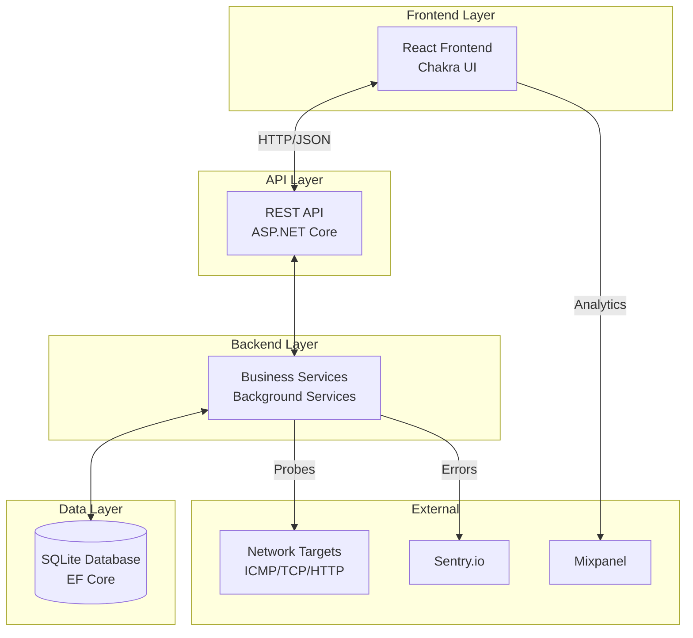
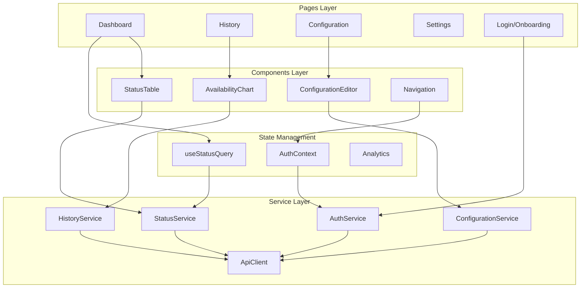
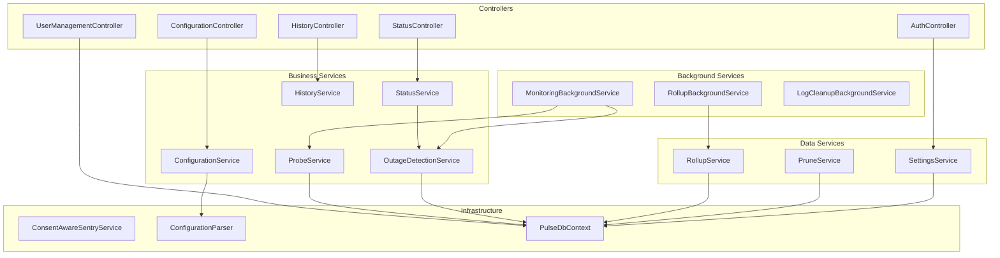
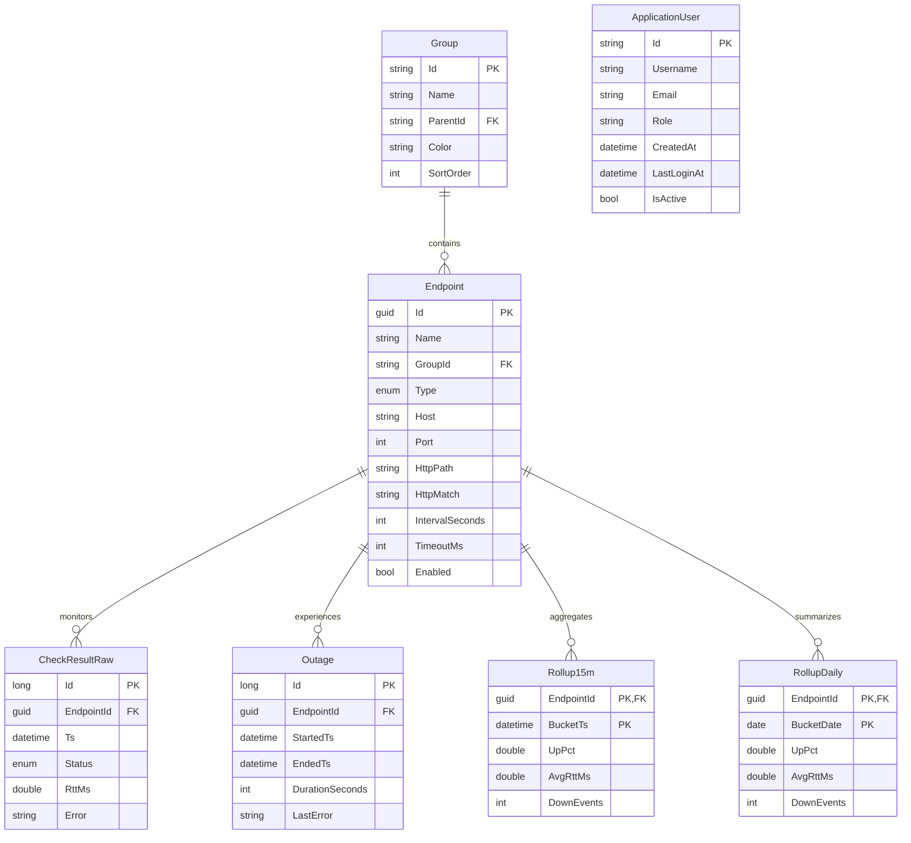
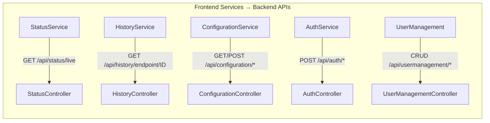
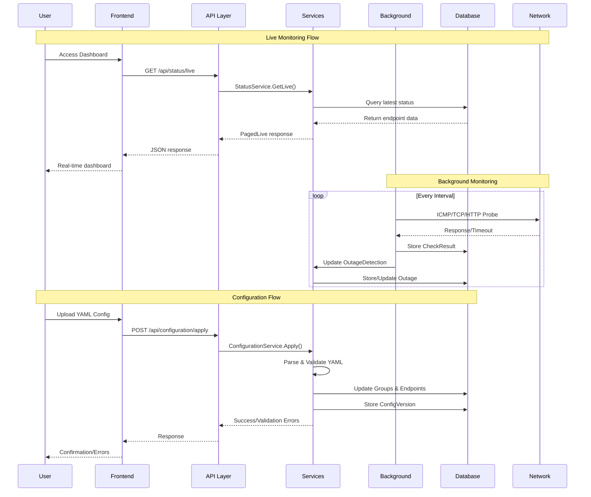
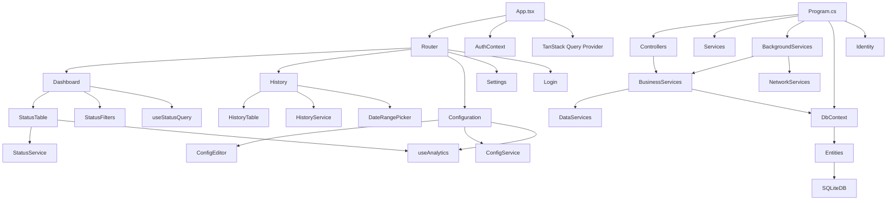

# ThingConnect.Pulse - Complete Architecture Diagram

## High-Level System Overview

## Frontend Architecture

## Backend Architecture

## Data Model Architecture

## API Relationship Matrix

### API Endpoints Detail

| Frontend Service | HTTP Method | Endpoint | Backend Controller | Purpose |
|-----------------|-------------|----------|-------------------|---------|
| StatusService | GET | `/api/status/live` | StatusController | Real-time endpoint status |
| HistoryService | GET | `/api/history/endpoint/{id}` | HistoryController | Historical data retrieval |
| ConfigurationService | GET | `/api/configuration/versions` | ConfigurationController | List config versions |
| ConfigurationService | GET | `/api/configuration/current` | ConfigurationController | Get current config |
| ConfigurationService | POST | `/api/configuration/apply` | ConfigurationController | Apply new config |
| AuthService | POST | `/api/auth/login` | AuthController | User authentication |
| AuthService | POST | `/api/auth/register` | AuthController | Initial user setup |
| AuthService | GET | `/api/auth/session` | AuthController | Session validation |
| AuthService | POST | `/api/auth/logout` | AuthController | User logout |
| UserManagement | GET | `/api/usermanagement/` | UserManagementController | List users |
| UserManagement | POST | `/api/usermanagement/` | UserManagementController | Create user |
| UserManagement | PUT | `/api/usermanagement/{id}` | UserManagementController | Update user |

## Data Flow Architecture

## Component Dependency Tree

## Key Architectural Patterns Summary

1. **Frontend Patterns:**
   - Component Composition with Chakra UI
   - Custom Hooks for business logic
   - Service Layer for API abstraction
   - TanStack Query for server state
   - Context API for authentication

2. **Backend Patterns:**
   - Controller → Service → Repository (EF Core)
   - Dependency Injection throughout
   - Background Services for long-running tasks
   - Configuration-driven external settings

3. **API Patterns:**
   - RESTful endpoints with proper HTTP verbs
   - Cookie-based authentication
   - JSON request/response with text/plain for YAML
   - Proper error handling and validation

4. **Data Patterns:**
   - Code-first EF Core with migrations
   - Time-series data with rollup aggregation
   - Hierarchical grouping with foreign keys
   - Soft delete patterns for users

5. **Integration Patterns:**
   - Polling-based real-time updates (5s intervals)
   - Client-side CSV generation
   - Consent-aware external service integration
   - Network probing with configurable retry logic